# LEBRE Architecture: Formal Architectural Diagrams & Visual Reference
**Version:** 0.1  
**Architecture:** LEBRE (*Lifecycle-governed Evidence-Based Resource Evolution*)  
**Historical Codename:** Track B Single-State Organization  
**Status:** Frozen Reference Specification with Scope Limits  
**Evidence Level:** VALIDATED_WITH_SCOPE_LIMITS  

This document serves as the formal visual catalog of the LEBRE architecture. It defines eight canonical architectural diagrams (**D1** through **D8**), each provided as:
1. A publication-grade standalone vector SVG asset located in `assets/diagrams/`.
2. A GitHub-compatible and KaTeX-friendly Mermaid diagram definition for version-controlled documentation rendering.
3. A formal architectural narrative specifying data invariants, control semantics, and empirical boundary conditions.

---

## Catalog of Canonical Diagrams

| ID | Title | SVG Reference | Key Architectural Invariant Illustrated |
|:---|:---|:---|:---|
| **D1** | High-Level Architecture & Information Flow | [lebre_high_level_architecture.svg](assets/diagrams/lebre_high_level_architecture.svg) | Dual-layer inference ($y_t = y_{\text{base}} + y_{\text{rec}}$) with decoupled control |
| **D2** | Five-State Structural Lifecycle State Machine | [lebre_lifecycle.svg](assets/diagrams/lebre_lifecycle.svg) | Five-state lifecycle: Dormant $\to$ Provisional $\to$ Active $\to$ Mature $\to$ Evicted |
| **D3** | Separation of Data Flow vs. Control Flow | [lebre_data_control_flow.svg](assets/diagrams/lebre_data_control_flow.svg) | Strict feedforward inference unblocked by structural governance |
| **D4** | Non-Interfering Shadow Probation Protocol | [lebre_shadow_probation.svg](assets/diagrams/lebre_shadow_probation.svg) | Zero inference disruption during candidate training ($G_{\text{cand}} > 0.05$) |
| **D5** | Two-Timescale Relevance & Quiescent Retention | [lebre_quiescent_retention.svg](assets/diagrams/lebre_quiescent_retention.svg) | Hysteresis protection bridging silent Poisson inter-burst intervals |
| **D6** | Dynamic Resource Elasticity Across Regimes | [lebre_resource_elasticity.svg](assets/diagrams/lebre_resource_elasticity.svg) | Real-time structural adaptation ($\approx 38$ to $92$ FLOPs/step mean) |
| **D7** | v0.1 Empirical Evidence Scope & Frozen Boundary | [lebre_v01_scope.svg](assets/diagrams/lebre_v01_scope.svg) | Validated scalar envelope vs. unopened multi-state frontier |
| **D8** | Online Prequential Operational Cycle | [lebre_prequential_cycle.svg](assets/diagrams/lebre_prequential_cycle.svg) | Strict 8-step causal sequence per prequential observation |

---

## D1. High-Level Architecture & System-Level Information Flow

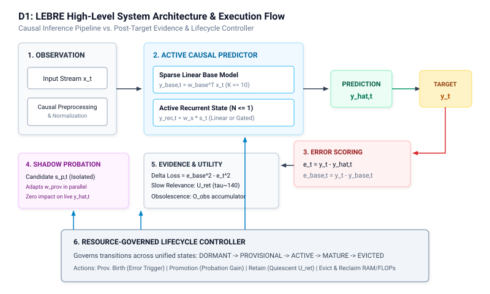

### Architectural Specification & Invariants
The LEBRE system decouples the causal feedforward inference path from post-target structural accounting:
1. **Observation Phase:** At time step $t$, streaming vector $x_t \in \mathbb{R}^D$ is preprocessed and ingested causally.
2. **Dual-Layer Inference:** 
   - The active sparse linear base produces $y_{\text{base},t} = w_{\text{base}}^\top x_t$.
   - The active scalar recurrent state ($N \le 1$) produces $y_{\text{rec},t} = w_s s_t$.
   - Total causal prediction is additive: $\hat{y}_t = y_{\text{base},t} + y_{\text{rec},t}$.
3. **Prequential Revelation:** Environmental target $y_t$ is revealed *only after* $\hat{y}_t$ is committed. Error signals $e_t = y_t - \hat{y}_t$ and $e_{\text{base},t} = y_t - y_{\text{base},t}$ are computed.
4. **Isolated Candidate Tracking:** A provisional candidate state $s_{p,t}$ learns in shadow mode without influencing $\hat{y}_t$.
5. **Lifecycle Controller:** Assesses incremental counterfactual gain $\Delta \mathcal{L}_t$ and structural observability $O_{\text{obs},t}$ to govern allocation and reclamation.

### Mermaid Diagram
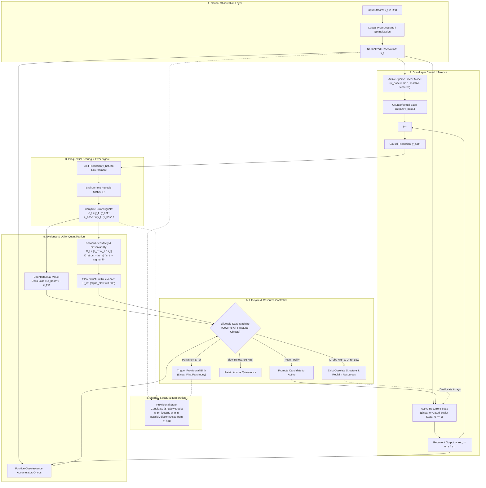

---

## D2. Five-State Structural Lifecycle State Machine

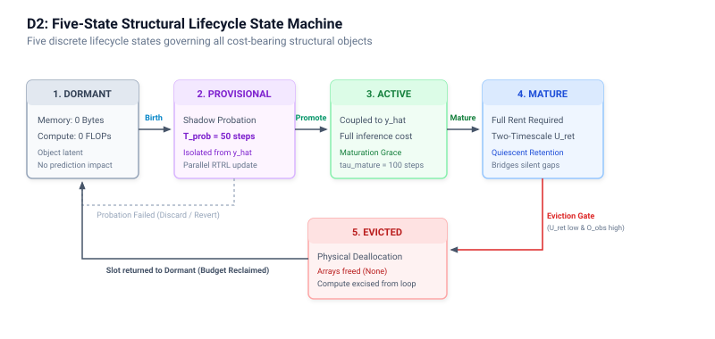
*Figure D2 — Five-State Structural Lifecycle State Machine. Every cost-bearing structural object progresses through five discrete lifecycle states (Dormant, Provisional, Active, Mature, Evicted) based on empirical evidence.*

### Architectural Specification & Invariants
Every cost-bearing structural object in LEBRE is governed by an instance of this five-state machine:
- **DORMANT:** The structural slot is unallocated (0 FLOPs, 0 Bytes allocated). It transitions to PROVISIONAL only when persistent unmodeled error persists ($E_{\text{linear}} > \theta_{\text{birth}}$ for $N_{\text{birth}} = 30$ steps).
- **PROVISIONAL:** Operates in shadow mode. The candidate receives input $x_t$ and updates weights via local gradient signals, but its output is zeroed in the inference graph ($g_p = 0.0$).
- **ACTIVE:** After probation horizon $T_{\text{prob}} = 50$ steps, if empirical relative MSE reduction exceeds $\theta_{\text{promote}} = 0.05$ ($>5\%$), the candidate is promoted and coupled to the live prediction graph ($g_p \to 1.0$). Enjoys maturation grace for $\tau_{\text{mature}} = 100$ steps with eviction immunity.
- **MATURE:** Upon surviving $\tau_{\text{mature}} = 100$ steps, the object enters mature monitoring where two-timescale relevance accounting ($U_{\text{ret}}$) bridges silent Poisson gaps while obsolescence ($O_{\text{obs}}$) accumulates.
- **EVICTED:** Physical arrays and gradient buffers are deallocated, freeing memory and computational budget for future structural adaptations. The slot returns to DORMANT.

### Mermaid Diagram
```mermaid
stateDiagram-v2
    [*] --> DORMANT : Object Non-Existent / Latent
    
    DORMANT --> PROVISIONAL : Birth Trigger<br>(Residual Error E_linear > theta_birth for N_birth steps)
    note right of DORMANT
        Memory Cost: 0 Bytes
        Compute Cost: 0 FLOPs
        Impact on Prediction: None
    end note

    PROVISIONAL --> ACTIVE : Promotion Trigger<br>(Candidate Gain > theta_promote after Probation Horizon T_prob)
    PROVISIONAL --> DORMANT : Probation Failure / Discard<br>(Gain <= theta_promote; try Gated or revert)
    note right of PROVISIONAL
        Shadow Mode: Learns parameters
        Memory Cost: Temporary candidate buffer
        Compute Cost: Forward + update in parallel
        Impact on Prediction: 0% (Isolated)
    end note

    ACTIVE --> MATURE : Maturation Transition<br>(Age >= tau_mature steps)
    note right of ACTIVE
        Coupled to live prediction y_hat
        Memory Cost: Persistent parameter storage
        Compute Cost: Full online inference + RTRL
        Eviction Immunity: Protected from early eviction
    end note

    MATURE --> MATURE : Quiescent Retention<br>(Input silent, but U_ret maintains memory)
    
    MATURE --> EVICTED : Eviction Trigger<br>(U_ret < theta_ret AND O_obs > theta_obs for patience steps)
    note right of MATURE
        Full structural rent demanded
        Assessed via two-timescale relevance
        Requires positive obsolescence to evict
    end note

    EVICTED --> DORMANT : Physical Resource Reclamation<br>(Arrays deallocated, weights zeroed, slot freed)
    note right of EVICTED
        Memory Cost: Released immediately
        Compute Cost: Excised from forward/update loop
        Terminal state for instance; frees budget for future birth
    end note
```

---

## D3. Separation of Data Flow vs. Control Flow

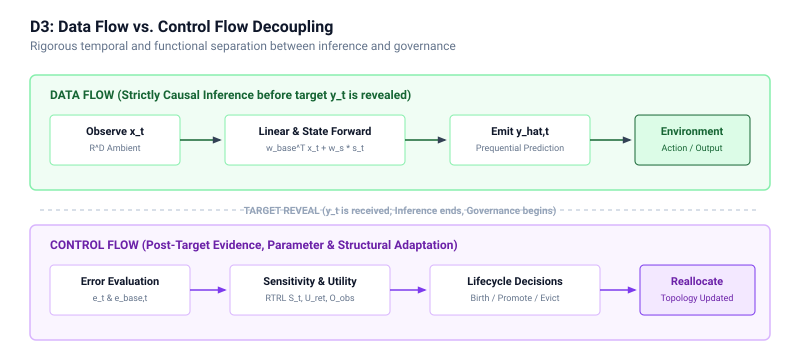

### Architectural Specification & Invariants
A fundamental architectural invariant of LEBRE is the physical separation between feedforward prediction and structural governance:
- **Data Flow (Microsecond Critical Path):** Consists of matrix-vector inner products and scalar activations. It executes synchronously upon arrival of $x_t$ without querying governance thresholds, ensuring bounded per-step execution latency.
- **Control Flow (Governance & Accounting):** Executes asynchronously or sequentially after target revelation $y_t$. It maintains structural statistics ($U_{\text{ret}}$, $O_{\text{obs}}$, $G_{\text{cand}}$) and triggers discrete structural transitions (Birth, Promotion, Eviction).

### Mermaid Diagram
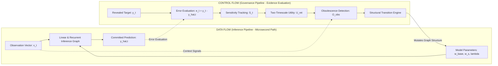

---

## D4. Non-Interfering Shadow Probation Protocol

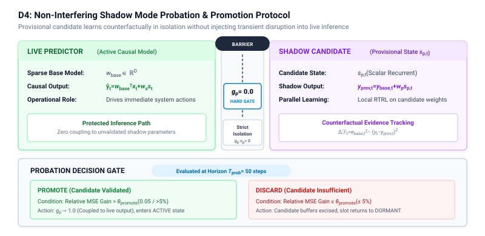
*Figure D4 — Non-Interfering Shadow Probation. A provisional candidate learns counterfactually in parallel while remaining strictly isolated from the live predictor until evidence-based promotion.*

### Architectural Specification & Invariants
Provisional structures are never permitted to disrupt live predictions:
1. A candidate state $s_{p,t}$ is instantiated in **Shadow Mode**.
2. It receives input $x_t$ and computes shadow forward passes and local RTRL updates.
3. Its output is multiplied by a hard gate $g_p = 0.0$, strictly isolating $\hat{y}_t$ from early gradient instability.
4. Over a fixed probation window $T_{\text{prob}} = 50$ steps, counterfactual error $e_{p,t} = y_t - (y_{\text{base},t} + w_p s_{p,t})$ is tracked.
5. If empirical relative reduction exceeds $\theta_{\text{promote}} = 0.05$ ($> 5\%$), the candidate is promoted ($g_p \to 1.0$); otherwise it is silently excised and its slot returns to DORMANT.

### Mermaid Diagram
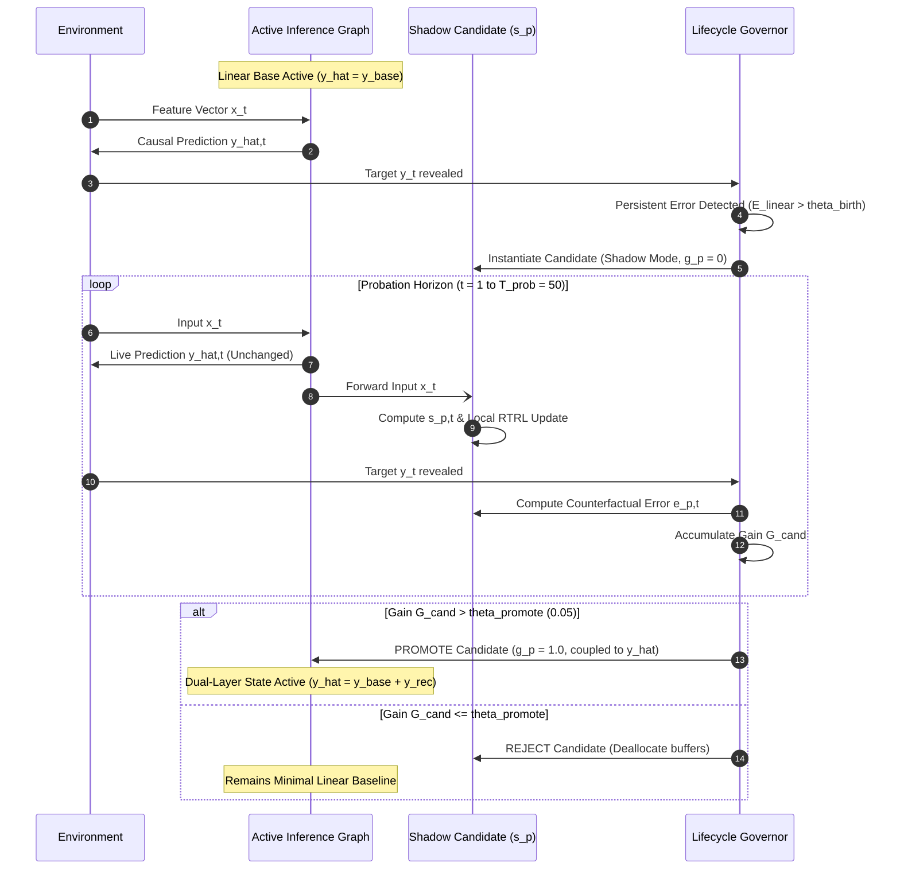

---

## D5. Two-Timescale Relevance & Quiescent Retention

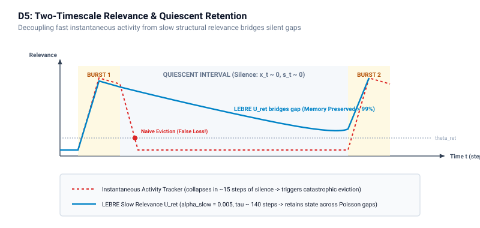

### Architectural Specification & Invariants
Systems relying on instantaneous activity ($|s_t| > \epsilon$) suffer catastrophic state eviction during quiescent inter-burst intervals (Poisson gaps). LEBRE resolves this via two-timescale filtering:
- **Fast Activity Metric:** Tracks instantaneous energy, collapsing to zero within $\approx 10$ silent steps.
- **Slow Structural Utility ($U_{\text{ret}}$):** Updated with $\alpha_{\text{slow}} = 0.005$ ($\tau \approx 140$ steps), preserving structural credit across extended periods of input silence.
- **Dual-Gated Eviction:** Requires both low slow utility ($U_{\text{ret}} < 0.02$) **AND** high positive obsolescence ($O_{\text{obs}} > 0.80$) sustained over a 30-step patience counter, enforcing the conservative $\approx 300:1$ empirical cost asymmetry.

### Mermaid Diagram
```mermaid
flowchart TD
    IN_SIGNAL["Incoming Event Stream"] -->|Sparse Bursts| EVENT{"Event Present at Step t?"}
    
    EVENT -->|YES| BURST["High Instantaneous Energy<br>|s_t| > 0, |e_t| > 0"]
    EVENT -->|NO (Silent Gap)| QUIET["Zero Instantaneous Activity<br>|s_t| -> 0, x_t -> 0"]
    
    BURST --> FAST["Fast Activity Tracker<br>(tau ~ 10 steps) -> Drops to 0 in Silence"]
    QUIET --> FAST
    
    FAST -.->|NAIVE RULE| NAIVE_FAIL["Naive Utility Eviction:<br>Triggers False Eviction at t=15 of silence!<br>Catastrophic state loss!"]
    
    BURST --> SLOW["LEBRE Two-Timescale Relevance (U_ret)<br>alpha_slow = 0.005 (tau ~ 140 steps)<br>Maintains structural credit across gaps"]
    QUIET --> SLOW
    
    QUIET --> OBS_CHECK["Positive Obsolescence Accumulator (O_obs)<br>Requires persistent non-informative input<br>over extended horizon"]
    
    SLOW & OBS_CHECK --> LEBRE_RULE{"LEBRE Hysteresis Gate:<br>U_ret < 0.02 AND O_obs > 0.80<br>Held for 30 consecutive steps?"}
    
    LEBRE_RULE -->|NO| SURVIVE["STATE RETAINED<br>Memory intact when next event arrives (P > 99%)"]
    LEBRE_RULE -->|YES (Confirmed Shift)| SAFE_EVICT["SAFE EVICTION<br>Resources reclaimed without regret"]
```

---

## D6. Dynamic Resource Elasticity Across Non-Stationary Regimes

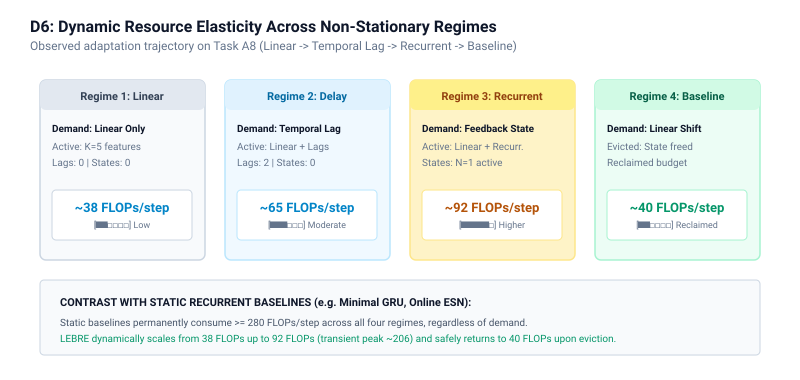

### Architectural Specification & Invariants
LEBRE dynamically scales structural complexity and computational overhead to match environmental non-stationarity, as demonstrated in benchmark Task A8:
1. **Regime 1 (Steps 0–2000, Linear):** Minimal sparse linear model ($\approx 38$ FLOPs/step mean, 0 recurrent states).
2. **Regime 2 (Steps 2000–4000, Lag Tap):** Temporal tap allocated ($\approx 65$ FLOPs/step mean).
3. **Regime 3 (Steps 4000–6000, Recurrent):** Scalar recurrent state allocated ($\approx 92$ FLOPs/step mean; transient peaks up to $\approx 206$ FLOPs/step during concurrent probe evaluation).
4. **Regime 4 (Steps 6000–8000, Linear Return):** Recurrence is safely evicted, budget is reclaimed, overhead returns to baseline ($\approx 40$ FLOPs/step mean).

### Mermaid Diagram
```mermaid
gantt
    title LEBRE Resource Elasticity and Compute Overhead (Task A8)
    dateFormat  X
    axisFormat %s

    section Environmental Regime
    Regime 1 (Linear Support Only)      :0, 2000
    Regime 2 (Temporal Lag Dynamic)     :2000, 4000
    Regime 3 (Recurrent Dynamic Needed) :4000, 6000
    Regime 4 (Return to Linear Baseline):6000, 8000

    section Active Structural Topology
    Sparse Linear Only (K=5, N=0)       :active, 0, 2000
    Linear + Lag Taps (K=5, L=2, N=0)   :crit, 2000, 4000
    Linear + Scalar Recurrence (N=1)    :crit, 4000, 6250
    Evicted Recurrence -> Linear Baseline:active, 6250, 8000

    section Computational Load (FLOPs/step mean)
    Low Compute (~38 FLOPs mean)        :done, 0, 2000
    Moderate Compute (~65 FLOPs mean)   :done, 2000, 4000
    High Compute (~92 FLOPs mean)       :done, 4000, 6250
    Reclaimed Budget (~40 FLOPs mean)   :done, 6250, 8000
```

---

## D7. v0.1 Empirical Evidence Scope & Frozen Boundary

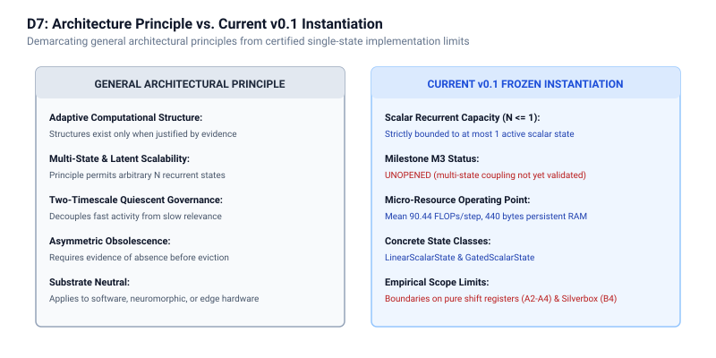

### Architectural Specification & Invariants
This diagram formalizes the strict boundary between empirically established facts in v0.1 and unverified hypotheses reserved for future research:
- **FROZEN EMPIRICAL ENVELOPE (v0.1):** Validated on benchmarks A1–A8 and B1–B5. Restricted strictly to scalar recurrence ($N \le 1$), linear-first parsimony, R2-FLOP compliance ($\le 100$ FLOPs/step mean), and software simulation.
- **FORBIDDEN NOVELTY CLAIMS:** Multi-state coordination ($N \ge 2$), continuous vector-state evolution, and hardware flashing (e.g. bare-metal ARM Cortex-M) are **strictly unverified** and must not be asserted as accomplished in v0.1.

### Mermaid Diagram
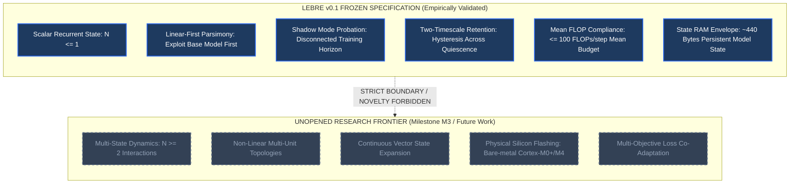

---

## D8. Online Prequential Operational Cycle

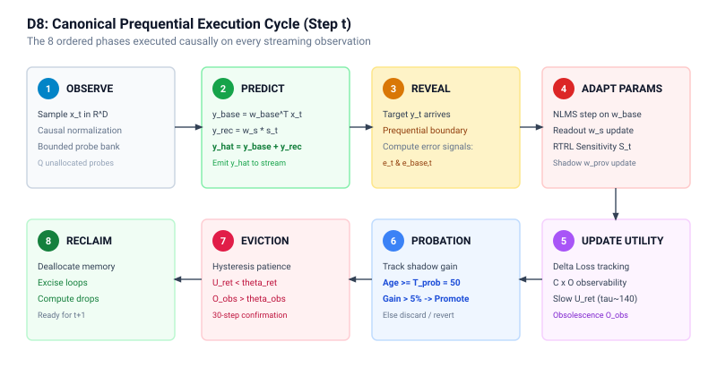

### Architectural Specification & Invariants
The prequential protocol requires absolute causal compliance at each time step $t$. Under no circumstances may future information leak into the prediction:
1. **Step 1: Input Ingestion ($x_t$):** Sensor or streaming observation is ingested.
2. **Step 2: Base Inference ($y_{\text{base},t}$):** Fast linear projection is evaluated.
3. **Step 3: Recurrent Inference ($y_{\text{rec},t}$):** Active scalar recurrent state produces dynamic contribution.
4. **Step 4: Causal Emission ($\hat{y}_t$):** Additive prediction $\hat{y}_t = y_{\text{base},t} + y_{\text{rec},t}$ is emitted.
5. **Step 5: Target Revelation ($y_t$):** Ground truth target is received from environment.
6. **Step 6: Residual Error Scoring ($e_t, e_{\text{base},t}$):** Prediction loss and base residual are quantified.
7. **Step 7: Gradient Updates ($w_{\text{base}}, w_s, \lambda$):** Online parameter adaptation is performed.
8. **Step 8: Lifecycle Evaluation:** Relevance, obsolescence, and candidate probation are evaluated.

### Mermaid Diagram
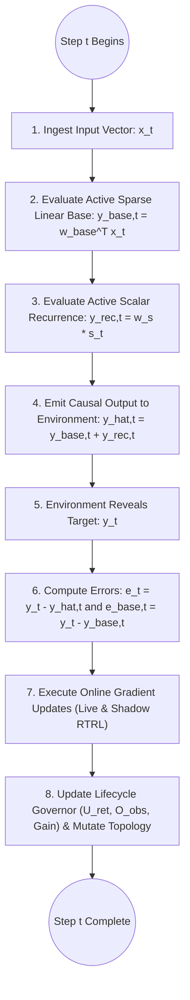
