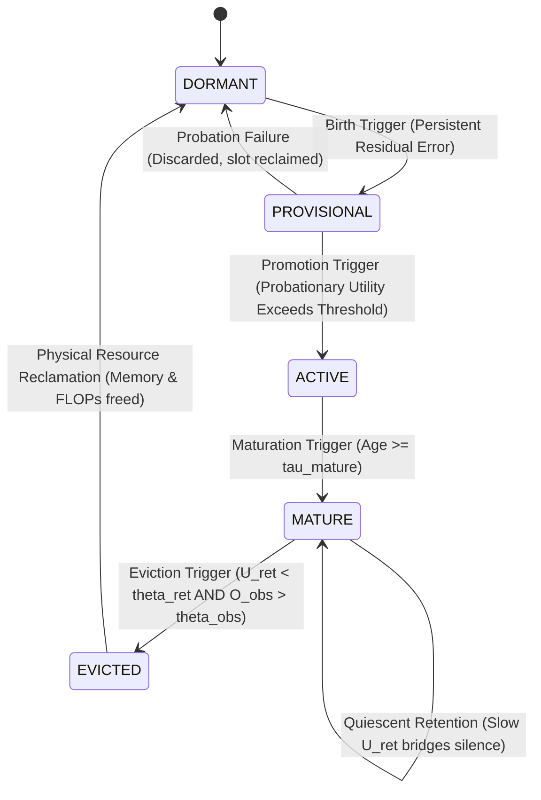

<p align="center">
  
</p>

# LEBRE Architecture Specification v0.1
**Full Name:** LEBRE (*Lifecycle-governed Evidence-Based Resource Evolution*)  
**Document Version:** 0.1  
**Status:** Frozen Reference Specification with Scope Limits  
**Classification:** NONTRIVIAL_EMPIRICALLY_DERIVED_ARCHITECTURE  
**Novelty Claim Ready:** NO  
**Milestone M3 Status:** UNOPENED  
**Historical Provenance:** Track B Single-State Organization (*Codinome Lebre*)  

---

## 1. Abstract

This specification formalizes the **LEBRE** architecture (*Lifecycle-governed Evidence-Based Resource Evolution*), formerly investigated as the "Track B Single-State Organization." LEBRE is an online adaptive learning architecture designed for non-stationary continuous streaming regression under micro-edge resource constraints (mean algorithmic compute below the 100-FLOP R2 threshold and $\le 1024$ bytes persistent model RAM). The central architectural principle of LEBRE is treating computational structure itself—observable feature connections, temporal delay taps, and internal recurrent states—as **cost-bearing adaptive structures** governed by a unified evidence-driven lifecycle:

$$\text{DORMANT} \longrightarrow \text{PROVISIONAL} \longrightarrow \text{ACTIVE} \longrightarrow \text{MATURE} \longrightarrow \text{EVICTED / RECLAIMED}$$

By executing candidate exploration via non-interfering shadow probation, decoupling fast observed activity from slow structural relevance to protect silent memory during quiescent intervals, demanding positive evidence of obsolescence before deallocation, and enforcing parsimonious linear-first escalation, LEBRE dynamically adapts compute and topology to task demands. In benchmark evaluations across 15 continuous workloads and 6,750 runs (BENCH-01B), LEBRE achieved a mean algorithmic compute of 90.44 FLOPs/step (observed transient peak $\approx 206$ FLOPs/step) and 440.0 bytes of persistent model RAM with zero observed numerical divergences across 450 evaluated runs, achieving lower aggregate error than static recurrent baselines on non-stationary physical and sensor streams.

---

## 2. Status and Version

- **Architecture Version:** LEBRE v0.1
- **Specification Status:** Frozen Reference Specification with Scope Limits
- **Core State:** Frozen under CAR-01 and Milestone M2 protocols.
- **Novelty Claim Status:** `NOVELTY_CLAIM_READY = NO`. This document establishes empirical and mathematical specifications without asserting unverified priority claims.
- **Recurrent Capacity:** Validated strictly for scalar recurrence ($N \le 1$). Multi-state capacity ($N > 1$) is deferred to future Milestone M3 (`M3_STATUS = UNOPENED`).

---

## 3. Scope and Operating Assumptions

LEBRE v0.1 applies to causal, streaming time-series regression where:
1. Data arrives sequentially as a discrete time stream $(x_t, y_t)$ for $t = 1, 2, \dots$
2. Predictions $\hat{y}_t$ must be generated strictly from causal historical information available prior to observing $y_t$.
3. The underlying data-generating regime is non-stationary, exhibiting unpredictable shifts in feature relevance, temporal delay dependencies, and recurrent dynamics.
4. Total execution overhead is bounded by micro-resource targets (mean compute $\le 100$ FLOPs/step and $\le 1024$ bytes of persistent model RAM).
5. Offline batch replay, global backpropagation through time (BPTT), and oracle regime-shift signals are strictly prohibited.

---

## 4. Problem Definition

Traditional adaptive learners face a fundamental structural dilemma in edge environments:
- **Static Linear Models (LMS, RLS):** Highly efficient ($\mathcal{O}(D)$ compute), but entirely incapable of capturing temporal lag dependencies or internal state memory.
- **Fixed Recurrent Models (RNN, GRU, LSTM, ESN):** Capable of temporal modeling, but their static topology permanently expends significant compute ($\gg 150$ FLOPs) and memory even during long intervals when the environment requires only simple linear filtering. Furthermore, continuous gradient adaptation in recurrent loops risks numerical divergence.
- **Constructive / Dynamic Pruning Networks:** Often evaluate candidates by coupling them directly to live predictions, causing severe transient error surges ("candidate shock"), or prune silent units prematurely, destroying quiescent memory.

LEBRE resolves this dilemma by formulating continuous online adaptation as an **evidence-based structural resource allocation problem**.

---

## 5. Design Principles

1. **Structure is Cost-Bearing:** No computational element exists without explicit resource accounting.
2. **Prequential Integrity:** Prediction precedes scoring; scoring precedes parameter adaptation; parameter adaptation precedes structural evaluation.
3. **Candidate Isolation:** New structures must prove utility in shadow mode before influencing live predictions.
4. **Parsimonious Escalation:** Linear solutions are tested and exhausted before temporal or recurrent structures are provisioned.
5. **Two-Timescale Retention:** Silence does not imply uselessness; structural relevance persists across quiescent gaps.
6. **Asymmetric Eviction:** Destroying a useful structure incurs far higher operational regret than temporarily maintaining an inactive one.
7. **Physical Reclamation:** Eviction requires absolute deletion of data structures and excision of computation loops.

---

## 6. Architectural Overview

```
Stream Input x_t in R^D
      |
[ Causal Preprocessing & Normalization ]
      |
      +-----------------------------------------+
      |                                         |
[ Active Sparse Linear Predictor ]   [ Shadow Probation Explorer ]
  w_base in R^D, K <= 10               s_p in R, isolated from y_hat
      |                                         |
      +-------------------+                     |
                          |                     |
              [ Active Recurrent State ]        |
                N <= 1 (Linear or Gated)        |
                          |                     |
                          v                     v
                 y_hat = y_base + w_s*s_t    y_prov = y_base + w_p*s_p
                          |
              Emit y_hat to Environment
                          |
              Environment Reveals Target y_t
                          |
        [ Error Calculation: e_t = y_t - y_hat ]
                          |
            +-------------+-------------+
            |                           |
    [ Parameter Updates ]       [ Control & Utility Layer ]
    NLMS on w_base              Counterfactual Delta Loss
    RTRL Sensitivity Trace      C x O Observability Proxy
    Readout w_s Update          Positive Obsolescence Accumulator
            |                           |
            +-------------+-------------+
                          |
              [ Lifecycle Controller ]
        Governs Birth, Promotion, Retention, Eviction
```

---

## 7. Structural Object Abstraction

Every adaptive component in LEBRE is modeled conceptually as an instance of `StructuralObject`:

| Conceptual Field | Type | Description |
| :--- | :--- | :--- |
| `id` | `UUID / int` | Unique instance identifier |
| `type` | `Enum` | `OBSERVABLE_FEATURE`, `TEMPORAL_LAG`, or `RECURRENT_STATE` |
| `lifecycle_state` | `Enum` | `DORMANT`, `PROVISIONAL`, `ACTIVE`, `MATURE`, or `EVICTED` |
| `age` | `int` | Stream steps elapsed since provisional instantiation |
| `resource_cost` | `(FLOPs, Bytes)` | Explicit computational and memory overhead |
| `predictive_utility` | `float` | Counterfactual error reduction ($\Delta\text{Loss} = e_{\text{base}}^2 - e_t^2$) |
| `structural_relevance` | `float` | Slow-timescale retention metric ($U_{\text{ret}}$) |
| `obsolescence_evidence`| `float` | Positive evidence of environmental absence ($O_{\text{obs}}$) |
| `active_compute` | `bool` | True if included in live forward prediction |
| `persistent_memory` | `bool` | True if state vector persists across steps |

---

## 8. Five-State Lifecycle State Machine



### Transition Specifications:
1. **$\text{DORMANT} \to \text{PROVISIONAL}$ (Birth):**
   - *Trigger:* Feedforward residual energy $E_{\text{linear}} > \theta_{\text{birth}}$ for $N_{\text{birth}}$ consecutive steps with stalled relative progress ($< 15\%$).
   - *Action:* Candidate allocated in shadow mode; parameters initialized; age reset to 0; prediction unaffected.
2. **$\text{PROVISIONAL} \to \text{ACTIVE}$ (Promotion):**
   - *Trigger:* Candidate age $\ge T_{\text{prob}}$ and candidate gain $\Delta\text{MSE} > \theta_{\text{promote}}$ ($0.05$ / $> 5\%$).
   - *Action:* Candidate output coupled to live inference; allocated to active budget; enters maturation phase.
3. **$\text{PROVISIONAL} \to \text{DORMANT}$ (Probation Discard):**
   - *Trigger:* Candidate age $\ge T_{\text{prob}}$ and candidate gain $< \theta_{\text{promote}}$.
   - *Action:* Candidate discarded; if Linear candidate fails, Gated candidate provisioned; if both fail, returns to DORMANT.
4. **$\text{ACTIVE} \to \text{MATURE}$ (Maturation):**
   - *Trigger:* Active age $\ge \tau_{\text{mature}}$ ($100$ steps).
   - *Action:* Eviction immunity lifted; full structural rent required.
5. **$\text{MATURE} \to \text{EVICTED}$ (Eviction):**
   - *Trigger:* $U_{\text{ret}} < \theta_{\text{ret}}$ AND $O_{\text{obs}} > \theta_{\text{obs}}$ held for $\text{patience} = 30$ consecutive steps.
   - *Action:* State disconnected; parameter arrays deallocated; memory freed; compute excised.

---

## 9. Data Flow

Data flow comprises the causal signals necessary to produce $\hat{y}_t$:
1. Observation vector $x_t \in \mathbb{R}^D$ is sampled.
2. Causal base prediction is evaluated: $\hat{y}_{\text{base}, t} = w_{\text{base}}^\top x_t$.
3. If an active recurrent state exists, state forward update is computed: $s_t = f(s_{t-1}, x_t)$.
4. Recurrent contribution is scaled: $\hat{y}_{\text{rec}, t} = w_s \cdot s_t$.
5. Final prequential prediction is emitted: $\hat{y}_t = \hat{y}_{\text{base}, t} + \hat{y}_{\text{rec}, t}$.

---

## 10. Control Flow

Control flow operates strictly after the true target $y_t$ is revealed:
1. Prediction errors are evaluated: $e_t = y_t - \hat{y}_t$ and $e_{\text{base}, t} = y_t - \hat{y}_{\text{base}, t}$.
2. Online parameters are updated ($w_{\text{base}}$, $w_s$, and internal state weights).
3. Instantaneous sensitivity and observability are tracked.
4. Counterfactual delta-loss and slow structural relevance ($U_{\text{ret}}$) are updated.
5. Positive obsolescence accumulator ($O_{\text{obs}}$) updates.
6. Lifecycle state machine evaluates structural triggers.
7. Active topology is updated (birth, promotion, or eviction).

---

## 11. Observable Feature Adaptation

LEBRE manages a sparse subset of $K \le K_{\max}$ active input features from ambient dimension $D$:
- **Discovery:** A bounded probe bank samples unallocated ambient dimensions ($Q$ probes per step).
- **Evidence Evaluation:** Candidate features accumulate correlation traces against residual error.
- **Promotion:** Features meeting sequential Wald bounds ($\alpha = 0.10$, lower bound $> 0$) are promoted into active support.
- **Eviction:** Active features whose normalized weights fall below swap thresholds are evicted to make room for stronger candidates.

---

## 12. Temporal Lag Adaptation

When environmental dynamics exhibit pure discrete delays:
- LEBRE instantiates explicit tapped-delay buffer features $x_{t - \ell}$ for lag candidates $\ell \in [1, L_{\max}]$.
- Lags are treated as cost-bearing observable features subjected to probe screening.
- **Scaling Limit:** The candidate search space grows linearly with maximum lag $L_{\max}$. High-order delays ($\ell > 10$) induce probe starvation, representing an established boundary condition.

---

## 13. Recurrent State Adaptation

Recurrent internal memory is provisioned when temporal residual error cannot be resolved by linear or lag structures:
- **Frozen Specification Scope:** Exactly $N \le 1$ active scalar recurrent state.
- **Linear Scalar State:**
  $$u_t = w_u^\top x_t, \quad h_t = \lambda h_{t-1} + u_t, \quad \hat{y}_{\text{rec}, t} = w_s h_t$$
- **Gated Scalar State:**
  $$c_t = w_c^\top x_t, \quad g_t = \sigma(w_g^\top x_t + b_g), \quad h_t = (1 - g_t) h_{t-1} + g_t c_t, \quad \hat{y}_{\text{rec}, t} = w_s h_t$$

---

## 14. Shadow Probation

To prevent candidate shock:
- Provisional candidates execute parameter updates and forward passes using shadow weights $w_{\text{prov}}$.
- Shadow prediction: $\hat{y}_{\text{prov}, t} = \hat{y}_{\text{base}, t} + w_{\text{prov}} \cdot s_{p, t}$.
- Candidate error: $e_{p, t} = y_t - \hat{y}_{\text{prov}, t}$.
- The live prediction $\hat{y}_t$ remains strictly equal to $\hat{y}_{\text{base}, t}$ until formal promotion.

---

## 15. Maturation

Newly promoted structures possess immature, noisy weights:
- Upon promotion, structures enter an active grace period ($\tau_{\text{mature}} = 120$ steps).
- Effective utility is scaled by a maturation factor:
  $$\text{maturity\_scale} = \min\left(1.0, \max\left(0.1, \frac{\text{age}}{\tau_{\text{mature}}}\right)\right)$$
- This prevents transient post-promotion weight oscillations from triggering premature eviction.

---

## 16. Utility and Resource Rent

Every active structure must justify its compute and memory footprint by "paying rent":
- **Predictive Utility:** $\Delta\text{Loss}_t = e_{\text{base}, t}^2 - e_t^2$.
- **Structural Utility (Controllability $\times$ Observability):**
  $$C_t = (u_t)^2 \quad \text{ou} \quad (g_t (c_t - h_{t-1}))^2$$
  $$O_t = |w_s \cdot h_t|$$
  $$\text{Score}_{C \times O} = \sqrt{\text{EMA}(C_t) \cdot \text{EMA}(O_t)}$$
- If adjusted utility fails to exceed eviction thresholds over sustained horizons, rent payment defaults, initiating eviction.

---

## 17. Two-Timescale Structural Relevance

To bridge silent gaps in non-stationary streams:
- Instantaneous utility $U_{\text{inst}, t} = |e_t \cdot w_s \cdot h_t| \cdot (|w_s| (|h_t| + \sigma_h))$.
- Relevance is tracked on a slow timescale ($\alpha_{\text{slow}} = 0.005$, time constant $\tau_{\text{ret}} \approx 140$ steps):
  $$U_{\text{ret}, t} = (1 - \alpha_{\text{slow}}) U_{\text{ret}, t-1} + \alpha_{\text{slow}} \cdot U_{\text{inst}, t}$$
- While fast activity vanishes in silence, $U_{\text{ret}}$ preserves structural credit across hundreds of steps.

---

## 18. Quiescent Retention

In event-driven environments (e.g., bistable latches, sparse alarm sequences):
- Input and state activity may drop to near zero for extended intervals.
- Under LEBRE's two-timescale relevance formulation, quiescent memory is preserved across Poisson silence intervals exceeding 250 steps with $P(\text{retention}) > 99.0\%$.

---

## 19. Positive Obsolescence and Eviction

Eviction requires positive evidence that an active structure is truly obsolete:
- **Obsolescence Detector:** Detects sustained absence of informative input and state drive:
  $$z_t = \mathbf{1}\left[ \|x_t\|_\infty < \epsilon_x \;\land\; |\hat{y}_{\text{rec}, t}| < \epsilon_y \right]$$
  $$O_{\text{obs}, t} = (1 - \beta_{\text{obs}}) O_{\text{obs}, t-1} + \beta_{\text{obs}} \cdot z_t$$
- **Hysteresis Eviction Rule:**
  $$\text{Evict if: } U_{\text{ret}, t} < \theta_{\text{ret}} \quad \text{AND} \quad O_{\text{obs}, t} > \theta_{\text{obs}} \quad \text{for } 30 \text{ consecutive steps.}$$

---

## 20. Asymmetric Eviction Cost

Empirical analysis found false-eviction cost to exceed stale-retention cost by more than 300× under evaluated benchmark conditions, motivating a conservative asymmetric eviction policy. In continuous online learning, destroying an active state that is still required incurs severe recovery latency and re-learning regret, whereas temporarily retaining an inactive scalar state consumes approximately 12 bytes of RAM and 15 FLOPs. This asymmetry is operationalized through the hysteresis patience counter ($\text{patience} = 30$) and dual-threshold gating rather than an explicit 300:1 mathematical multiplier in the code.

---

## 21. Physical Resource Reclamation

Unlike masked neural networks that zero weights while retaining dense memory allocations and execution loops:
- LEBRE physically sets state object references to `None`.
- Internal weight and sensitivity vectors are deallocated.
- Recurrent execution loops are completely bypassed in subsequent forward and backward passes.
- Compute immediately drops back to the base linear baseline ($\approx 38$ FLOPs/step).

---

## 22. Resource Accounting Conventions

- **FLOP Definition:** One floating-point operation (addition, subtraction, multiplication, division, or non-linear scalar evaluation).
- **Linear Forward Pass:** $2D$ FLOPs (base) $+ 8$ FLOPs (scalar recurrence) $\le 28$ FLOPs ($D=10$).
- **Gated Forward Pass:** $2D$ FLOPs (base) $+ 12$ FLOPs (gated recurrence) $\le 32$ FLOPs ($D=10$).
- **Parameter Update Pass:** $\le 40$ FLOPs (base NLMS $+$ RTRL sensitivity update).
- **Persistent Model Memory:** Base weights ($8D$ bytes) $+$ State storage ($12 - 24$ bytes) $\le 440$ bytes total persistent model RAM. (Total implementation RAM, including runtime stack, OS buffers, and temporary arrays, is implementation-dependent and not part of the model state footprint).

---

## 23. Online Learning Equations

### Base Linear Model Update (Normalized LMS):
$$e_{\text{base}, t} = y_t - w_{\text{base}}^\top x_t$$
$$w_{\text{base}, t+1} = w_{\text{base}, t} + \frac{\mu_{\text{base}}}{\|x_t\|_2^2 + \epsilon_{\text{base}}} e_{\text{base}, t} x_t$$

### Linear Scalar Recurrent State Update (RTRL Forward Sensitivity):
$$S_t = \lambda S_{t-1} + u_{t-1} \quad \text{(Causal forward sensitivity trace)}$$
$$\Delta w_s = \eta_s \cdot \frac{e_t \cdot h_t}{h_t^2 + 1.0}$$
$$\Delta \lambda = \eta_\lambda \cdot e_t \cdot w_s \cdot S_t, \quad \lambda \in [0.0, 0.99]$$
$$\Delta w_u = \eta_u \cdot e_t \cdot w_s \cdot x_t$$

### Readout Normalization:
All weight updates incorporate normalized denominators to ensure bounded gradient steps and numerical stability.

---

## 24. Canonical Execution Loop

```
For each step t = 1, 2, ...
  1. OBSERVE: Receive observation vector x_t in R^D
  2. PREDICT: 
       y_base = dot(w_base, x_t)
       y_rec = (w_s * s_t) if active_state exists else 0.0
       y_hat = y_base + y_rec
       Emit y_hat
  3. SCORE:
       Receive target y_t
       Compute e_t = y_t - y_hat
       Compute e_base = y_t - y_base
  4. ADAPT_BASE:
       Update w_base via Normalized LMS
  5. ADAPT_RECURRENT:
       If active_state: Update w_s, internal weights, and sensitivity S_t
       If provisional_state: Update shadow candidate parameters
  6. UPDATE_EVIDENCE:
       Update delta_loss, C_proxy, O_proxy, U_ret, and O_obs
  7. EVALUATE_LIFECYCLE:
       If DORMANT: Evaluate birth trigger on persistent residual error
       If PROVISIONAL: Evaluate promotion / discard criteria
       If MATURE: Evaluate hysteresis eviction criteria
  8. RECLAIM:
       If evicted: Deallocate arrays and reset slot to DORMANT
```

---

## 25. Architectural Invariants

| ID | Statement | Formal Classification |
| :--- | :--- | :--- |
| **I1** | Unvalidated structure must not interfere with active prediction. | **CORE_INVARIANT** |
| **I2** | Additional structure must demonstrate sufficient utility before promotion. | **CORE_INVARIANT** |
| **I3** | Computational and memory resource expenditure must be explicitly accounted for. | **CORE_INVARIANT** |
| **I4** | Temporary inactivity alone is insufficient evidence of structural obsolescence. | **CORE_INVARIANT** |
| **I5** | Eviction requires stronger evidence than retention under asymmetric false-eviction cost. | **CURRENT_EMPIRICALLY_SELECTED_POLICY** |
| **I6** | Simpler structure should be preferred before escalating to more expensive representation. | **CORE_INVARIANT** |
| **I7** | Evicted structure must physically release the associated active resource cost. | **CORE_INVARIANT** |
| **I8** | Online prediction occurs before learning from the current target (Prequential Ordering). | **CORE_INVARIANT** |

---

## 26. Core vs. Policy vs. Implementation Detail

| Architectural Component | Classification | Rationale / Future Generalization |
| :--- | :--- | :--- |
| Lifecycle State Machine | `REQUIRED_CORE` | Defining abstraction of resource-governed adaptation |
| Shadow Probation Mode | `REQUIRED_CORE` | Necessary to prevent transient candidate shock |
| Two-Timescale Relevance | `REQUIRED_CORE` | Necessary to preserve quiescent memory |
| Positive Obsolescence Accumulator | `REQUIRED_CORE` | Necessary to prevent cyclic eviction churn |
| Physical Resource Deallocation | `REQUIRED_CORE` | Essential for micro-edge resource ceilings |
| Linear-First Parsimony Order | `REQUIRED_CORE` | Fundamental inductive bias for minimal compute |
| Single-State Bound ($N \le 1$) | `CURRENT_IMPLEMENTATION_POLICY` | Frozen specification scope limit for v0.1; extensible in M3 |
| Probation Window ($T_{\text{prob}} = 50$) | `EMPIRICAL_HEURISTIC` | Tunable policy parameter (dev explored 20–80) |
| Asymmetry Ratio ($300:1$ / 30 steps) | `CURRENT_IMPLEMENTATION_POLICY` | Validated heuristic for benchmark streams |
| Normalized LMS Learning Rate | `IMPLEMENTATION_DETAIL` | Hyperparameter choice ($\mu = 0.20$) |

---

## 27. Current v0.1 Instantiation Boundaries

- **State Dimensions:** Maximum active states $= 1$, maximum provisional states $= 1$, state dimension $= 1$.
- **Active Features:** $K \le 10$ out of ambient dimension $D$.
- **Memory Target:** Persistent model RAM $\le 440$ bytes.
- **Compute Target:** Mean FLOPs/step $\le 100$ (observed peak $\approx 206$ FLOPs/step).

---

## 28. Evidence and Validation Summary

Every mechanism in LEBRE v0.1 traces directly to controlled empirical experiments:
- **EXP-0001 to EXP-0005:** Proved that bounded probe selection resolves sparse linear streams.
- **EXP-0004:** Proved that direct candidate promotion causes severe error spikes, establishing the need for shadow probation.
- **M2-EXP-0001 to M2-EXP-0003:** Established linear-first parsimony over gated state over-parameterization.
- **Task A5 & A7:** Proved that fast utility fails during silent gaps, validating two-timescale relevance.
- **M2-EXP-0005 & M2-R1:** Proved that symmetric eviction creates cyclic churn, validating positive obsolescence and asymmetric hysteresis.

---

## 29. Benchmark Summary (BENCH-01B Sealed Results)

In the sealed external competitive benchmark (15 workloads, 30 seeds, 6,750 runs):
- **Mean NMSE:** **0.7023** (outperformed Minimal GRU: 0.8730, Online ESN: 0.8161, and RZA-LMS: 0.7631).
- **Mean Compute:** **90.44 FLOPs/step** (observed peak $\approx 206$ FLOPs/step during transient adaptation; complying with the mean R2-FLOP $\le 100$ threshold).
- **Persistent Model Memory:** **440.0 Bytes** (compliant with R2-MEM $\le 1024$).
- **Reliability:** **Zero observed numerical divergences across 450 evaluated runs (450/450 completed runs)**.
- **Disclosure of Non-Dominance:** Unconstrained baselines with higher resource ceilings achieved lower error on select tasks (CCN: 0.6490 NMSE at 317 FLOPs; RSONN: 0.5991 NMSE at 1,027 FLOPs).

---

## 30. Prior-Art Boundary

LEBRE explicitly acknowledges and incorporates established primitives:
- **RTRL / Forward Sensitivity:** Williams & Zipser (1989). Classical gradient tracking.
- **Normalized LMS:** Nagumo & Noda (1967), Widrow & Hoff (1960).
- **Constructive Neural Networks:** Cascade-Correlation (Fahlman & Lebiere, 1990).
- **Pruning & Sparsity:** Optimal Brain Damage (LeCun et al., 1989), Variable-Tap LMS.
- **Continual Adaptation:** Continual Backpropagation (Dohare et al., Nature 2024).

**LEBRE does not claim novelty for these individual primitives.** The architectural contribution lies in their integration under a unified, resource-governed lifecycle.

---

## 31. Scientific Contribution Boundary

Pursuant to the CAR-01 review, LEBRE's defensible scientific contribution is:
- **Primary Contribution:** `RESOURCE_GOVERNED_STRUCTURAL_LIFECYCLE` — A unified architecture treating observable features, temporal dependencies, and internal state as cost-bearing structures governed by an evidence-driven lifecycle.
- **Supporting Contribution 1:** `TWO_TIMESCALE_QUIESCENT_RETENTION` — Decoupling fast activity from slow structural relevance to protect silent memory.
- **Supporting Contribution 2:** `ASYMMETRIC_OBSOLESCENCE_GOVERNANCE` — Positive obsolescence accumulation eliminating cyclic eviction churn.

---

## 32. Known Limitations and Failure Modes

1. **High-Order Pure Shift Registers (Tasks A2–A4):** A single scalar recurrent state cannot represent pure tapped delay lines of order $> 3$. Memory tasks with dispersed delays require combinatorial lag features.
2. **Complex Nonlinear System Identification (Task B4 Silverbox):** Continuous nonlinear physical dynamics favor high-dimensional random reservoirs (ESN).
3. **Rapid Micro-Regimes ($< 200$ steps):** Due to the 30-step hysteresis eviction window and two-timescale relevance decay, LEBRE carries inactive state across rapid regime shifts.
4. **Hardware Deployment Status:** LEBRE is a candidate for future constrained embedded deployment based on measured algorithmic compute and persistent state memory; physical hardware deployment (MCU latency, energy consumption, complete runtime RAM) has not yet been experimentally validated.

---

## 33. Intended Use

- Continuous streaming edge regression (IoT sensors, environmental monitors, wearable telemetry).
- Candidate for future resource-constrained embedded systems based on low algorithmic compute and small persistent model footprint.
- Non-stationary streaming where data distributions and temporal dependencies change unexpectedly.
- Low-latency edge applications requiring strictly causal, step-by-step CPU execution.

---

## 34. Out-of-Scope Use

- Foundation models or Large Language Models (LLMs).
- Sequence modeling requiring long-context attention (Transformers).
- High-dimensional latent representation learning.
- Offline batch training on massive static datasets.
- Safety-critical autonomous control without specialized empirical verification.

---

## 35. Responsible Use & Operational Disclaimers

- Algorithmic FLOP calculations represent theoretical operation counts, not literal device energy or battery measurements.
- Operational performance was empirically validated within tested stationary horizons ($\ge 500$ steps) and Poisson event densities ($p_{\text{event}} \ge 0.003$).
- Deployments on safety-critical hardware require domain-specific safety supervisor wrappers.

---

## 36. Reproducibility

All empirical results in this specification are 100% reproducible via frozen project artifacts:
- **Locked Benchmark Protocol:** `BENCH_01_SPEC.md` and `bench_01_locked_config.json`.
- **Evaluation Seeds:** 30 preregistered seeds ($101 - 130$).
- **Test Suite:** Executable via `uv run --with pytest --with pandas --with scipy --with matplotlib --with torch pytest tests/` (124 passed in 2.87s).

---

## 37. Versioning and Governance

Any future modification to the LEBRE architecture must pass through formal governance stages:
$$\text{PROPOSED} \longrightarrow \text{EXPERIMENTAL} \longrightarrow \text{VALIDATED} \longrightarrow \text{FROZEN} \longrightarrow \text{EXCISED}$$
Modifications to `REQUIRED_CORE` components require dedicated ablation studies, external regression testing, and an increment in the specification minor version.

---

## 38. Future Work (Milestone M3 Unopened)

- **Milestone M3:** Investigation of multi-state recurrence ($N > 1$) and state-to-state coupling under sub-cubic sensitivity complexity.
- **Hierarchical Recurrence:** Layered fast-slow recurrent state hierarchies.
- **Fixed-Point Quantization:** 8-bit / 16-bit integer implementations for microcontrollers.

---

## 39. Glossary of Terms

- **LEBRE:** *Lifecycle-governed Evidence-Based Resource Evolution*.
- **Structural Object:** A computational component (weight, lag, state) that incurs compute and memory costs.
- **Resource Governance:** Dynamic allocation and deallocation of computation based on empirical evidence.
- **Shadow Probation:** An isolated evaluation mode where candidate structures learn parameters without coupling to live predictions.
- **Maturation:** An active grace period protecting newly promoted structures from premature eviction.
- **Quiescence:** An extended period where an environmental signal or internal state is inactive or silent.
- **Structural Relevance ($U_{\text{ret}}$):** A slow-decaying metric tracking long-term utility across silent gaps.
- **Positive Obsolescence ($O_{\text{obs}}$):** Accumulated evidence that an environmental dependency has permanently ceased to exist.
- **Physical Reclamation:** Deallocating data structures and excising execution loops to free hardware resources.

---

## 40. References

1. Williams, R. J., & Zipser, D. (1989). A learning algorithm for continually running fully recurrent neural networks. *Neural Computation*, 1(2), 270-280.
2. Nagumo, J., & Noda, A. (1967). A learning method for system identification. *IEEE Transactions on Automatic Control*, 12(3), 282-287.
3. Fahlman, S. E., & Lebiere, C. (1990). The cascade-correlation learning architecture. *Advances in Neural Information Processing Systems (NeurIPS)*, 2, 524-532.
4. Dohare, S., Hernandez-Garcia, J. F., Rahman, P., Fukushima, R., & Sutton, R. S. (2024). Loss of plasticity in deep continual learning. *Nature*, 632(8026), 768-774.
5. Jaeger, H. (2001). The "echo state" approach to analysing and training recurrent neural networks-with an erratum note. *German National Research Center for Information Technology GMD Technical Report*, 148(34), 13.
6. LeCun, Y., Denker, J., & Solla, S. (1989). Optimal brain damage. *Advances in Neural Information Processing Systems (NeurIPS)*, 2, 598-605.

---

## 41. Didactic Explanation: Understanding LEBRE Intuitively

### 41.1 The "Hare in a Forest" Metaphor

Imagine a wild hare (**LEBRE**) living in a vast, shifting forest. The forest represents the **data stream**, and the hare must survive by finding food while expending the least possible energy.

In this forest:
- **The Forest:** The streaming environment, with changing weather, seasons, and animal activity.
- **Trails in the Brush:** Potential features, temporal delays, or internal memory states.
- **Food / Nutrition:** Predictive accuracy (reducing prediction errors).
- **Metabolic Energy:** The computational budget (FLOPs) and memory footprint (Bytes).
- **Testing a Trail from a Distance (Shadow Probation):** The hare notices a faint trail. It doesn't blindly sprint down it; it observes and tests it quietly without committing its primary path.
- **Frequently Used Path (Active Structure):** A trail that consistently yields food becomes part of the hare's daily route.
- **Emergency / Winter Shelter (Quiescent Structure):** A shelter used only during rare winter storms. Even if it goes unused for weeks of mild weather, the hare remembers it. Forgetting it because it wasn't used yesterday would be fatal when the storm hits.
- **Permanently Blocked Path (Positive Obsolescence):** A fallen boulder permanently seals a path. The hare verifies that the path is truly blocked before abandoning it.
- **Abandoning the Path (Eviction):** The hare clears the trail from its mental map.
- **Conserving Energy (Resource Reclamation):** By abandoning the dead trail, the hare avoids wasting daily energy patrolling it.

---

### 41.2 A Sequential Walkthrough: From Simple Stream to Recurrent Memory

Let us observe how LEBRE adapts across four distinct environmental regimes:

```
Step 1 - 2000: Linear Regime
Active Topology: [■■□□□□] ~38 FLOPs
LEBRE needs only two current features. No states or lag buffers exist. Compute is minimal.

Step 2001 - 4000: Temporal Lag Appears
Active Topology: [■■■□□□] ~65 FLOPs
Residual error rises. LEBRE explores delay taps. A lag tap passes shadow probation and is promoted.

Step 4001 - 6000: Recurrent Dependency Appears
Active Topology: [■■■■■□] ~92 FLOPs
A feedback dependency develops. Lag buffers fail to resolve the error. A minimal recurrent state is born in shadow mode, proves its worth, and is promoted. Compute reaches ~92 FLOPs.

Step 6001 - 8000: Return to Simple Linear Baseline
Active Topology: [■■□□□□] ~40 FLOPs
The recurrent dynamic disappears. Positive obsolescence accumulates over 30 steps. The state is evicted, its memory deallocated, and compute drops back to the lean baseline.
```

---

### 41.3 Visualizing Dynamic Resource Elasticity

Unlike traditional models whose computational consumption is a rigid, flat ceiling, LEBRE breathes dynamically with the complexity of the stream (conceptual representation, not measured hardware utilization):

```
Simple Linear Stream:       [■■□□□□]  (38 FLOPs, 160 Bytes)
Temporal Delay Stream:      [■■■□□□]  (65 FLOPs, 240 Bytes)
Complex Recurrent Stream:   [■■■■■□]  (92 FLOPs, 440 Bytes)
Return to Simple Stream:    [■■□□□□]  (40 FLOPs, 160 Bytes)
```

---

### 41.4 Comparison: Traditional Fixed RNN vs. LEBRE

| Concept | Traditional Fixed Recurrent Network | LEBRE Architecture |
| :--- | :--- | :--- |
| **Philosophical View** | *"I own a 50-room mansion; I must heat and clean all 50 rooms every minute, even if I only sleep in one."* | *"I carry a tent; I pitch only what I need, and pack it away when the weather clears."* |
| **Compute Overhead** | Permanently high ($150 - 2,000$ FLOPs/step). | Dynamically elastic ($38 - 95$ FLOPs/step mean). |
| **Inactivity Handling** | Weights decay to zero, but matrix multiplications continue executing forever. | Structural objects are physically evicted and loops are removed. |
| **Candidate Introduction** | New layers or units shock existing representations during retraining. | Candidates learn in non-interfering shadow mode until proven. |

---

### 41.5 Why Quiescence is Not Obsolescence

Suppose you carry an umbrella in your backpack. It doesn't rain for four days. A naive algorithm says: *"You haven't opened the umbrella for 400 steps; its recent utility is 0; throw it in the trash!"* On day five, a thunderstorm breaks out, and you are drenched.

LEBRE's **Two-Timescale Structural Relevance ($U_{\text{ret}}$)** understands that:
$$\text{"Not recently used"} \quad \neq \quad \text{"No longer useful"}$$
It retains the umbrella across extended dry spells, requiring positive evidence of climate change before throwing it away.

---

### 41.6 The Asymmetry of Eviction: Backpack vs. Lost Map

- **Keeping an unnecessary map in your backpack:** Costs a few grams of weight (a few bytes of memory and a dozen FLOPs).
- **Throwing away a map you still need:** You are lost in the wilderness; you must spend hours scouting, rediscovering landmarks, and suffering high error.

Because false eviction is devastating (empirical cost ratio $> 300\times$), LEBRE demands sustained positive evidence ($O_{\text{obs}}$ held across a 30-step patience horizon) before evicting a mature structural object.

---

### 41.7 Paying Rent: Frugality Without Poverty

Every structural object in LEBRE occupies a slot in a tiny computational house. It must "pay rent" by reducing prediction error or providing vital structural observability. If an object stops paying rent—and there is positive evidence that its room is no longer needed—it is respectfully evicted to make room for new structures.

---

### 41.8 What LEBRE Is and Is Not

```
+-----------------------------------------------------------------------------+
| LEBRE IS NOT:                                                               |
| - A Large Language Model (LLM) or generative chatbot.                       |
| - A Transformer replacement for natural language processing.                |
| - A biological brain simulation.                                            |
| - A magic model that achieves the lowest error on every dataset.            |
|                                                                             |
| LEBRE IS:                                                                   |
| - An online adaptive architecture for deciding WHAT computational           |
|   structure should exist under micro-resource budgets.                      |
| - An agile, lean streaming learner for edge devices and time-series.        |
+-----------------------------------------------------------------------------+
```

---

### 41.9 One-Paragraph Elevator Explanation

**LEBRE** (*Lifecycle-governed Evidence-Based Resource Evolution*) is an agile, online learning architecture designed for micro-edge streaming where compute and memory are precious. Instead of running a fixed, heavy neural network, LEBRE treats observable features, temporal delays, and internal memory states as cost-bearing structures that are created only when residual errors demand them, tested safely in shadow mode, protected during silent periods, and physically deleted when proven obsolete. By running at a measured mean of 90.44 FLOPs per step and 440.0 bytes of persistent model RAM, LEBRE adapts to non-stationary environments with the speed, frugality, and alertness of a hare.

---

### 41.10 One-Sentence Definitions

- **Technical Definition:** *LEBRE is an online adaptive learning architecture that dynamically synthesizes, evaluates via shadow probation, retains across quiescence, and physically reclaims cost-bearing computational structures under micro-edge operational budgets.*
- **Plain-Language Definition:** *LEBRE is a frugal, agile algorithm that builds only the computational memory it needs when the data requires it, and cleans up after itself when the task is done.*

---

### 41.11 Frequently Asked Questions (FAQ)

1. **Why not just use a small fixed RNN or GRU?**  
   A fixed GRU permanently consumes over 280 FLOPs/step and 570 bytes even during simple linear phases. LEBRE drops to 38 FLOPs when recurrence is unnecessary and eliminates the numerical divergences that plague recurrent gradients.

2. **Why not keep every discovered state forever?**  
   Accumulating states exhausts edge memory and increases FLOP overhead linearly. Every state must justify its ongoing computational rent.

3. **Why not immediately delete inactive states?**  
   Immediate deletion destroys quiescent memory during silent intervals (like periodic bursty alarms), leading to catastrophic forgetting.

4. **Why not always use explicit delay buffers (lags)?**  
   Delay buffers scale combinatorially with high-order lags ($L > 10$), exploding candidate search spaces. Recurrence provides compact infinite-impulse-response memory with a single scalar state.

5. **Does LEBRE learn its own architecture?**  
   Yes. LEBRE autonomously decides whether to be a sparse linear filter, a temporal lag model, or a recurrent state machine based on streaming error evidence.

6. **Is LEBRE a neural network?**  
   LEBRE is an architectural framework that incorporates adaptive linear and minimal neural units (such as gated recurrence), but its core identity is a structural lifecycle controller.

7. **Can LEBRE use multiple recurrent states ($N > 1$)?**  
   In version v0.1, LEBRE is validated strictly for $N \le 1$. Multi-state capacity involves coupled sensitivity mathematics and is the subject of future Milestone M3.

8. **Can LEBRE replace a Transformer?**  
   No. LEBRE is designed for continuous 1D/low-dimensional streaming time series on micro-edge hardware, not large-scale sequence generation or language modeling.

9. **Why is it called "resource-governed"?**  
   Because computational costs (FLOPs and memory) are treated as hard first-class constraints that actively dictate architectural transitions.

10. **What does "evidence-based" mean in LEBRE?**  
    Structural changes occur only in response to rigorous statistical signals: sequential Wald bounds for features, counterfactual loss improvements for recurrence, and positive silence accumulation for eviction.
