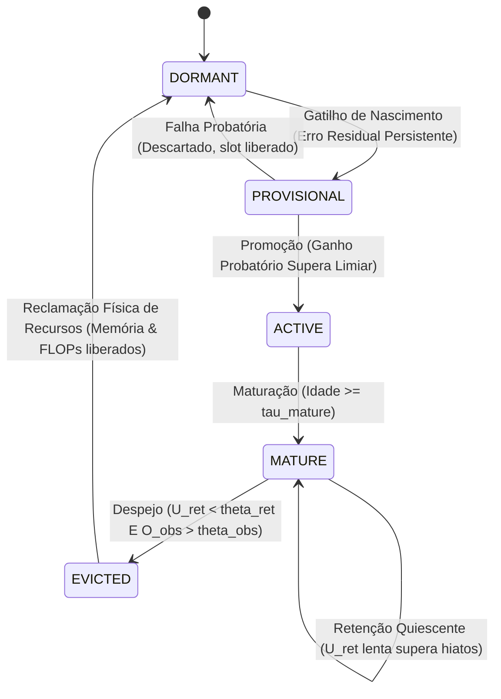

<p align="center">
  
</p>

# Especificação da Arquitetura LEBRE v0.1
**Nome Completo:** LEBRE (*Lifecycle-governed Evidence-Based Resource Evolution*)  
*(Evolução de Recursos Baseada em Evidência e Governada por Ciclo de Vida)*  
**Versão do Documento:** 0.1  
**Status:** Especificação de Referência Congelada com Limites de Escopo  
**Classificação:** NONTRIVIAL_EMPIRICALLY_DERIVED_ARCHITECTURE  
**Reivindicação de Ineditismo:** NÃO (NOVELTY_CLAIM_READY = NO)  
**Status do Marco M3:** NÃO ABERTO (UNOPENED)  
**Proveniência Histórica:** Organização de Estado Único Track B (*Codinome Lebre*)  

---

## 1. Resumo (Abstract)

Esta especificação formaliza a arquitetura **LEBRE** (*Lifecycle-governed Evidence-Based Resource Evolution*), anteriormente investigada sob a designação provisória de "Organização de Estado Único Track B". A LEBRE é uma arquitetura online de aprendizado adaptativo projetada para regressão streaming contínua e não estacionária sob restrições de micro-recursos (computação algorítmica média abaixo do limiar R2 de 100 FLOPs e $\le 1024$ bytes de RAM persistente de modelo). O princípio arquitetural central da LEBRE consiste em tratar a própria estrutura computacional—conexões de features observáveis, atrasos temporais (lags) e estados recorrentes internos—como **estruturas adaptativas com custo**, governadas por um ciclo de vida unificado e orientado por evidência:

$$\text{DORMENTE} \longrightarrow \text{PROVISÓRIO} \longrightarrow \text{ATIVO} \longrightarrow \text{MADURO} \longrightarrow \text{REMOVIDO / RECLAMADO}$$

Ao executar a exploração de candidatos via estágio probatório em sombra (sem interferência na predição ativa), desacoplar a atividade observada rápida da relevância estrutural lenta para preservar a memória silenciosa durante intervalos de quiescência, exigir evidência positiva de obsolescência antes da desalocação e impor uma escalada parcimoniosa linear-primeiro, a LEBRE adapta dinamicamente a computação e a topologia às demandas da tarefa. Em avaliações no benchmark selado de 15 cargas de trabalho contínuas e 6.750 execuções (BENCH-01B), a LEBRE alcançou média de computação algorítmica de 90,44 FLOPs/passo (pico transitório observado de $\approx 206$ FLOPs/passo) e 440,0 bytes de RAM persistente de modelo com zero divergências numéricas observadas em 450 execuções avaliadas, superando baselines recorrentes estáticas em fluxos físicos e de sensores não estacionários.

---

## 2. Status e Versão

- **Versão da Arquitetura:** LEBRE v0.1
- **Status da Especificação:** Especificação de Referência Congelada com Limites de Escopo
- **Estado do Core:** Congelado sob os protocolos CAR-01 e Marco M2.
- **Status de Ineditismo:** `NOVELTY_CLAIM_READY = NO`. Este documento estabelece especificações matemáticas e empíricas rigorosas sem reivindicar ineditismo científico não verificado.
- **Capacidade Recorrente:** Validada estritamente para recorrência escalar ($N \le 1$). A capacidade multi-estado ($N > 1$) está reservada para o futuro Marco M3 (`M3_STATUS = UNOPENED`).

---

## 3. Escopo e Premissas Operacionais

A LEBRE v0.1 aplica-se à regressão causal de séries temporais em streaming contínuo, onde:
1. Os dados chegam sequencialmente como um fluxo temporal discreto $(x_t, y_t)$ para $t = 1, 2, \dots$
2. As predições $\hat{y}_t$ devem ser geradas estritamente a partir de informações causais históricas disponíveis antes da observação de $y_t$.
3. O regime gerador subjacente é não estacionário, exibindo mudanças imprevistas na relevância de atributos, dependências temporais de atraso e dinâmicas recorrentes.
4. O consumo de recursos é delimitado por metas de micro-recursos (computação média $\le 100$ FLOPs/passo e $\le 1024$ bytes de RAM persistente de modelo).
5. Treinamento em lote offline (batch replay), retropropagação através do tempo global (BPTT) e sinais oraculares de mudança de regime são estritamente proibidos.

---

## 4. Definição do Problema

Sistemas adaptativos tradicionais enfrentam um dilema estrutural fundamental em ambientes de borda (edge):
- **Modelos Lineares Estáticos (LMS, RLS):** Altamente eficientes ($\mathcal{O}(D)$ computação), mas incapazes de capturar atrasos temporais ou memória recorrente interna.
- **Modelos Recorrentes Fixos (RNN, GRU, LSTM, ESN):** Capazes de modelagem temporal, mas sua topologia estática gasta permanentemente computação elevada ($\gg 150$ FLOPs) e memória, mesmo em longos períodos em que o ambiente exige apenas filtragem linear simples. Além disso, o ajuste contínuo de gradientes em laços recorrentes induz instabilidades numéricas severas.
- **Redes Construtivas / Poda Dinâmica:** Frequentemente avaliam candidatos acoplando-os diretamente à predição ativa, causando choques transitórios severos ("choque de candidato"), ou realizam a poda de unidades silenciosas prematuramente, destruindo a memória quiescente.

A LEBRE resolve esse dilema formulando a adaptação online contínua como um **problema de alocação de recursos estruturais orientada por evidência**.

---

## 5. Princípios de Projeto

1. **A Estrutura Possui Custo (Cost-Bearing):** Nenhum elemento computacional existe sem contabilização explícita de recursos.
2. **Integridade Prequencial:** A predição precede a avaliação de erro; o erro precede o ajuste de parâmetros; o ajuste precede a reavaliação estrutural.
3. **Isolamento de Candidatos:** Estruturas em teste devem comprovar utilidade em modo sombra antes de influenciar predições reais.
4. **Escalada Parcimoniosa:** Soluções lineares são testadas e esgotadas antes que estruturas temporais ou recorrentes sejam instanciadas.
5. **Retenção em Duas Escalas Temporais:** O silêncio não implica inutilidade; a relevância estrutural persiste através de intervalos quiescentes.
6. **Despejo Assimétrico:** Destruir uma estrutura útil acarreta um custo de arrependimento operacional muito mais alto do que manter temporariamente uma estrutura inativa.
7. **Reclamação Física:** O despejo exige a desalocação efetiva de arrays e a eliminação de laços de computação.

---

## 6. Visão Geral da Arquitetura

```
Fluxo de Entrada x_t em R^D
      |
[ Pré-processamento Causal & Normalização ]
      |
      +-----------------------------------------+
      |                                         |
[ Preditor Linear Esparso Ativo ]    [ Explorador em Estágio Probatório ]
  w_base em R^D, K <= 10               s_p em R, isolado de y_hat
      |                                         |
      +-------------------+                     |
                          |                     |
              [ Estado Recorrente Ativo ]       |
                N <= 1 (Linear ou Gated)        |
                          |                     |
                          v                     v
                 y_hat = y_base + w_s*s_t    y_prov = y_base + w_p*s_p
                          |
              Emite y_hat ao Ambiente
                          |
              Ambiente Revela o Alvo y_t
                          |
        [ Cálculo de Erro: e_t = y_t - y_hat ]
                          |
            +-------------+-------------+
            |                           |
    [ Atualização de Parâmetros ] [ Camada de Controle & Utilidade ]
    NLMS sobre w_base             Delta Loss Contrafactual
    Traço de Sensibilidade RTRL   Proxy de Observabilidade C x O
    Atualização de Readout w_s    Acumulador de Obsolescência Positiva
            |                           |
            +-------------+-------------+
                          |
              [ Controlador de Ciclo de Vida ]
        Governa Nascimento, Promoção, Retenção e Despejo
```

---

## 7. Abstração do Objeto Estrutural (StructuralObject)

Cada componente adaptativo na LEBRE é modelado conceitualmente como uma instância de `StructuralObject`:

| Campo Conceitual | Tipo | Descrição |
| :--- | :--- | :--- |
| `id` | `UUID / int` | Identificador único da instância |
| `type` | `Enum` | `OBSERVABLE_FEATURE`, `TEMPORAL_LAG`, ou `RECURRENT_STATE` |
| `lifecycle_state` | `Enum` | `DORMANT`, `PROVISIONAL`, `ACTIVE`, `MATURE`, ou `EVICTED` |
| `age` | `int` | Passos de tempo decorridos desde a instanciação provisória |
| `resource_cost` | `(FLOPs, Bytes)` | Custo computacional explícito e pegada de memória RAM |
| `predictive_utility` | `float` | Redução contrafactual de erro ($\Delta\text{Loss} = e_{\text{base}}^2 - e_t^2$) |
| `structural_relevance` | `float` | Métrica de retenção em escala lenta ($U_{\text{ret}}$) |
| `obsolescence_evidence`| `float` | Evidência positiva de ausência ambiental ($O_{\text{obs}}$) |
| `active_compute` | `bool` | Verdadeiro se computado na predição ativa em tempo real |
| `persistent_memory` | `bool` | Verdadeiro se o vetor de estado persiste entre passos |

---

## 8. Máquina de Estados do Ciclo de Vida de Cinco Estados



### Especificação das Transições:
1. **$\text{DORMANT} \to \text{PROVISIONAL}$ (Nascimento):**
   - *Gatilho:* Energia residual linear $E_{\text{linear}} > \theta_{\text{birth}}$ por $N_{\text{birth}}$ passos com progresso relativo estagnado ($< 15\%$).
   - *Ação:* Candidato alocado em modo sombra; parâmetros inicializados; idade zerada; predição ativa inalterada.
2. **$\text{PROVISIONAL} \to \text{ACTIVE}$ (Promoção):**
   - *Gatilho:* Idade do candidato $\ge T_{\text{prob}}$ e ganho $\Delta\text{MSE} > \theta_{\text{promote}}$ ($0,05$ / $> 5\%$).
   - *Ação:* Saída do candidato conectada à inferência ativa; integrado ao orçamento ativo; inicia fase de maturação.
3. **$\text{PROVISIONAL} \to \text{DORMANT}$ (Descarte Probatório):**
   - *Gatilho:* Idade $\ge T_{\text{prob}}$ e ganho $< \theta_{\text{promote}}$.
   - *Ação:* Candidato descartado; se o candidato Linear falha, testa-se o candidato Gated; se ambos falham, retorna a DORMANT.
4. **$\text{ACTIVE} \to \text{MATURE}$ (Maturação):**
   - *Gatilho:* Idade ativa $\ge \tau_{\text{mature}}$ ($100$ passos).
   - *Ação:* Imunidade de despejo é suspensa; exige-se pagamento integral de aluguel estrutural.
5. **$\text{MATURE} \to \text{EVICTED}$ (Despejo):**
   - *Gatilho:* $U_{\text{ret}} < \theta_{\text{ret}}$ E $O_{\text{obs}} > \theta_{\text{obs}}$ mantidos por $\text{patience} = 30$ passos consecutivos.
   - *Ação:* Estado desconectado; arrays de parâmetros desalocados; memória liberada; laço de computação excisado.

---

## 9. Fluxo de Dados (Data Flow)

O fluxo de dados engloba os sinais causais estritamente necessários para emitir $\hat{y}_t$:
1. O vetor de observação $x_t \in \mathbb{R}^D$ é amostrado causalmente.
2. A predição linear base é calculada: $\hat{y}_{\text{base}, t} = w_{\text{base}}^\top x_t$.
3. Se houver um estado recorrente ativo, computa-se o avanço de estado: $s_t = f(s_{t-1}, x_t)$.
4. A contribuição recorrente é escalada pelo peso de readout: $\hat{y}_{\text{rec}, t} = w_s \cdot s_t$.
5. A predição prequencial final é emitida: $\hat{y}_t = \hat{y}_{\text{base}, t} + \hat{y}_{\text{rec}, t}$.

---

## 10. Fluxo de Controle (Control Flow)

O fluxo de controle opera estritamente após a revelação do alvo real $y_t$:
1. Os erros são calculados: $e_t = y_t - \hat{y}_t$ e $e_{\text{base}, t} = y_t - \hat{y}_{\text{base}, t}$.
2. Parâmetros do modelo são atualizados ($w_{\text{base}}$, $w_s$ e parâmetros internos do estado).
3. Sensibilidades e observabilidades instantâneas são registradas.
4. O delta-loss contrafactual e a relevância estrutural lenta ($U_{\text{ret}}$) são atualizados.
5. O acumulador de obsolescência positiva ($O_{\text{obs}}$) é incrementado.
6. A máquina de estados do ciclo de vida avalia gatilhos de transição.
7. A topologia ativa é reconfigurada (nascimento, promoção ou despejo físico).

---

## 11. Adaptação de Features Observáveis

A LEBRE gerencia um subconjunto esparso de $K \le K_{\max}$ features ativas dentre a dimensão ambiente $D$:
- **Descoberta:** Um banco de sondagem delimitado amostra dimensões não alocadas ($Q$ sondas por passo).
- **Avaliação de Evidência:** Features candidatas acumulam traços de correlação contra o erro residual.
- **Promoção:** Atributos que atendem aos limites sequenciais de Wald ($\alpha = 0,10$, limite inferior $> 0$) são promovidos ao suporte ativo.
- **Despejo:** Features ativas cujos pesos normalizados caem abaixo dos limiares de substituição são despejadas.

---

## 12. Adaptação de Atrasos Temporais (Lags)

Quando a dinâmica ambiental exibe atrasos puramente discretos:
- A LEBRE instancia variáveis explícitas de atraso $x_{t - \ell}$ para candidatos $\ell \in [1, L_{\max}]$.
- Atrasos são tratados como features observáveis sujeitas à sondagem delimitada.
- **Limite de Escala:** O espaço de busca de candidatos cresce linearmente com $L_{\max}$. Atrasos de alta ordem ($\ell > 10$) induzem inanição de sondagem (probe starvation), representando uma fronteira empírica documentada.

---

## 13. Adaptação de Estados Recorrentes

A memória recorrente interna é instanciada quando o erro residual não pode ser resolvido por estruturas lineares ou de atraso:
- **Escopo da Especificação Congelada:** Exatamente $N \le 1$ estado recorrente escalar ativo.
- **Estado Escalar Linear:**
  $$u_t = w_u^\top x_t, \quad h_t = \lambda h_{t-1} + u_t, \quad \hat{y}_{\text{rec}, t} = w_s h_t$$
- **Estado Escalar com Portas (Gated):**
  $$c_t = w_c^\top x_t, \quad g_t = \sigma(w_g^\top x_t + b_g), \quad h_t = (1 - g_t) h_{t-1} + g_t c_t, \quad \hat{y}_{\text{rec}, t} = w_s h_t$$

---

## 14. Estágio Probatório em Sombra (Shadow Probation)

Para prevenir choques de candidatos na predição ativa:
- Candidatos provisórios atualizam parâmetros e realizam passadas diretas usando pesos sombra $w_{\text{prov}}$.
- Predição sombra: $\hat{y}_{\text{prov}, t} = \hat{y}_{\text{base}, t} + w_{\text{prov}} \cdot s_{p, t}$.
- Erro do candidato: $e_{p, t} = y_t - \hat{y}_{\text{prov}, t}$.
- A predição real $\hat{y}_t$ permanece estritamente igual a $\hat{y}_{\text{base}, t}$ até que ocorra a promoção formal.

---

## 15. Maturação

Estruturas recém-promovidas possuem pesos imaturos e oscilantes:
- Ao serem promovidas, as estruturas entram em um período de carência ($\tau_{\text{mature}} = 120$ passos).
- A utilidade efetiva é escalada por um fator de maturação:
  $$\text{fator\_maturação} = \min\left(1,0, \max\left(0,1, \frac{\text{idade}}{\tau_{\text{mature}}}\right)\right)$$
- Esse fator impede que oscilações pós-promoção acionem despejos imediatos e prematuros.

---

## 16. Utilidade e Aluguel de Recursos (Resource Rent)

Toda estrutura ativa deve justificar seu custo de computação e memória "pagando aluguel":
- **Utilidade Preditiva:** $\Delta\text{Loss}_t = e_{\text{base}, t}^2 - e_t^2$.
- **Utilidade Estrutural (Controlabilidade $\times$ Observabilidade):**
  $$C_t = (u_t)^2 \quad \text{ou} \quad (g_t (c_t - h_{t-1}))^2$$
  $$O_t = |w_s \cdot h_t|$$
  $$\text{Pontuação}_{C \times O} = \sqrt{\text{EMA}(C_t) \cdot \text{EMA}(O_t)}$$
- Se a utilidade ajustada falha em cobrir o limiar de aluguel por períodos sustentados, inicia-se o processo de despejo.

---

## 17. Relevância Estrutural em Duas Escalas Temporais

Para transpor hiatos de silêncio em fluxos não estacionários:
- Utilidade instantânea $U_{\text{inst}, t} = |e_t \cdot w_s \cdot h_t| \cdot (|w_s| (|h_t| + \sigma_h))$.
- A relevância é acumulada em uma escala temporal lenta ($\alpha_{\text{slow}} = 0,005$, constante $\tau_{\text{ret}} \approx 140$ passos):
  $$U_{\text{ret}, t} = (1 - \alpha_{\text{slow}}) U_{\text{ret}, t-1} + \alpha_{\text{slow}} \cdot U_{\text{inst}, t}$$
- Enquanto a atividade instantânea cai a zero no silêncio, $U_{\text{ret}}$ preserva o crédito estrutural por centenas de passos.

---

## 18. Retenção durante Quiescência

Em ambientes orientados a eventos raros (latches biestáveis, sensores com alarmes esparsos):
- O sinal de entrada e o estado podem aproximar-se de zero por longos períodos.
- Sob a métrica de duas escalas da LEBRE, a memória quiescente é preservada ao longo de intervalos de Poisson superiores a 250 passos com $P(\text{retenção}) > 99,0\%$.

---

## 19. Obsolescência Positiva e Despejo

O despejo exige evidência positiva de que uma estrutura ativa tornou-se verdadeiramente obsoleta:
- **Detector de Obsolescência:** Detecta a ausência continuada de sinal informativo:
  $$z_t = \mathbf{1}\left[ \|x_t\|_\infty < \epsilon_x \;\land\; |\hat{y}_{\text{rec}, t}| < \epsilon_y \right]$$
  $$O_{\text{obs}, t} = (1 - \beta_{\text{obs}}) O_{\text{obs}, t-1} + \beta_{\text{obs}} \cdot z_t$$
- **Regra de Despejo por Histerese:**
  $$\text{Despejar se: } U_{\text{ret}, t} < \theta_{\text{ret}} \quad \text{E} \quad O_{\text{obs}, t} > \theta_{\text{obs}} \quad \text{por } 30 \text{ passos consecutivos.}$$

---

## 20. Custo Assimétrico de Despejo

A análise empírica constatou que o custo de um falso despejo supera o custo de uma retenção inativa por mais de $300\times$ sob as condições avaliadas, motivando uma política de despejo conservadora e assimétrica. Destruir um estado ativo que ainda é necessário acarreta severa latência de recuperação e erro de reaprendizado, enquanto carregar temporariamente um estado escalar inativo consome aproximadamente 12 bytes de RAM e 15 FLOPs. Essa assimetria é operacionalizada através do contador de histerese ($\text{patience} = 30$) e limiares duplos, e não por um multiplicador matemático hardcoded no código.

---

## 21. Recuperação Física de Recursos

Diferente de redes neurais com máscaras que apenas zeram pesos enquanto mantêm arrays e laços de computação alocados:
- A LEBRE anula as referências dos objetos (`None`).
- Vetores internos de parâmetros e sensibilidades são desalocados da memória RAM.
- Laços de execução recorrente são totalmente contornados nas passadas seguintes.
- A computação retorna imediatamente à linha de base puramente linear ($\approx 38$ FLOPs/passo).

---

## 22. Contabilização de Recursos

- **Definição de FLOP:** Uma operação de ponto flutuante (soma, subtração, multiplicação, divisão ou função não linear escalar).
- **Passada Direta Linear:** $2D$ FLOPs (base) $+ 8$ FLOPs (recorrência linear) $\le 28$ FLOPs ($D=10$).
- **Passada Direta Gated:** $2D$ FLOPs (base) $+ 12$ FLOPs (recorrência com portas) $\le 32$ FLOPs ($D=10$).
- **Passada de Atualização:** $\le 40$ FLOPs (NLMS base $+$ atualização de sensibilidade RTRL).
- **Memória Persistente de Modelo:** Pesos base ($8D$ bytes) $+$ Estrutura de estado ($12 - 24$ bytes) $\le 440$ bytes totais de RAM persistente de modelo. (A RAM total de implementação, incluindo pilha de execução, buffers do sistema operacional e arrays temporários, depende do runtime e não integra a pegada de estado do modelo).

---

## 23. Equações de Aprendizado Online

### Atualização do Modelo Linear Base (NLMS Normalizado):
$$e_{\text{base}, t} = y_t - w_{\text{base}}^\top x_t$$
$$w_{\text{base}, t+1} = w_{\text{base}, t} + \frac{\mu_{\text{base}}}{\|x_t\|_2^2 + \epsilon_{\text{base}}} e_{\text{base}, t} x_t$$

### Atualização do Estado Recorrente Linear (Sensibilidade Direta RTRL):
$$S_t = \lambda S_{t-1} + u_{t-1} \quad \text{(Traço causal de sensibilidade direta)}$$
$$\Delta w_s = \eta_s \cdot \frac{e_t \cdot h_t}{h_t^2 + 1,0}$$
$$\Delta \lambda = \eta_\lambda \cdot e_t \cdot w_s \cdot S_t, \quad \lambda \in [0,0, 0,99]$$
$$\Delta w_u = \eta_u \cdot e_t \cdot w_s \cdot x_t$$

### Normalização do Readout:
Todas as atualizações incorporam denominadores normalizados para garantir passos de gradiente limitados e robustez numérica.

---

## 24. Laço de Execução Canônico

```
Para cada passo t = 1, 2, ...
  1. OBSERVAR: Amostrar vetor de observação x_t em R^D
  2. PREVER: 
       y_base = dot(w_base, x_t)
       y_rec = (w_s * s_t) se active_state existir, senão 0.0
       y_hat = y_base + y_rec
       Emitir y_hat
  3. PONTUAR:
       Receber alvo real y_t
       Calcular e_t = y_t - y_hat
       Calcular e_base = y_t - y_base
  4. ADAPTAR_BASE:
       Atualizar w_base via NLMS normalizado
  5. ADAPTAR_RECORRENTE:
       Se active_state: Atualizar w_s, pesos internos e sensibilidade S_t
       Se provisional_state: Atualizar parâmetros do candidato em sombra
  6. ATUALIZAR_EVIDÊNCIA:
       Atualizar delta_loss, C_proxy, O_proxy, U_ret e O_obs
  7. AVALIAR_CICLO_DE_VIDA:
       Se DORMENTE: Avaliar gatilho de nascimento sob erro persistente
       Se PROVISÓRIO: Avaliar critérios de promoção ou descarte
       Se MADURO: Avaliar critérios de histerese para despejo
  8. RECUPERAR:
       Se despejado: Desalocar arrays e retornar o slot para DORMENTE
```

---

## 25. Invariantes Arquiteturais

| ID | Enunciado | Classificação Formal |
| :--- | :--- | :--- |
| **I1** | Estruturas não validadas não podem interferir na predição ativa. | **CORE_INVARIANT** |
| **I2** | Estruturas adicionais devem comprovar utilidade antes da promoção. | **CORE_INVARIANT** |
| **I3** | O consumo de recursos (FLOPs e bytes) deve ser explicitamente contabilizado. | **CORE_INVARIANT** |
| **I4** | A inatividade temporária por si só não constitui evidência de obsolescência. | **CORE_INVARIANT** |
| **I5** | O despejo exige evidência mais forte que a retenção sob custos assimétricos. | **CURRENT_EMPIRICALLY_SELECTED_POLICY** |
| **I6** | Estruturas mais simples devem ser preferidas antes de escaladas caras. | **CORE_INVARIANT** |
| **I7** | Estruturas despejadas devem liberar fisicamente os recursos alocados. | **CORE_INVARIANT** |
| **I8** | A predição online precede o aprendizado do alvo atual (Ordem Prequencial). | **CORE_INVARIANT** |

---

## 26. Componentes: Core vs. Política vs. Detalhe de Implementação

| Componente Arquitetural | Classificação | Justificativa / Generalização Futura |
| :--- | :--- | :--- |
| Máquina de Estados do Ciclo de Vida | `REQUIRED_CORE` | Abstração definidora da adaptação governada por recursos |
| Estágio Probatório em Sombra | `REQUIRED_CORE` | Imprescindível para prevenir choques de candidatos |
| Relevância em Duas Escalas | `REQUIRED_CORE` | Imprescindível para preservar memória em períodos de silêncio |
| Acumulador de Obsolescência Positiva | `REQUIRED_CORE` | Imprescindível para eliminar oscilações de despejo e renascimento |
| Desalocação Física de Recursos | `REQUIRED_CORE` | Essencial para cumprir tetos severos de micro-recursos |
| Escalada Linear-Primeiro | `REQUIRED_CORE` | Viés indutivo fundamental para computação mínima |
| Limite de Estado Único ($N \le 1$) | `CURRENT_IMPLEMENTATION_POLICY` | Limite de escopo congelado da v0.1; expansível no M3 |
| Janela de Provação ($T_{\text{prob}} = 50$) | `EMPIRICAL_HEURISTIC` | Parâmetro de política ajustável (dev explorou 20–80) |
| Razão de Assimetria ($300:1$ / 30 passos) | `CURRENT_IMPLEMENTATION_POLICY` | Heurística validada para fluxos do benchmark |
| Taxa de Aprendizado do NLMS | `IMPLEMENTATION_DETAIL` | Escolha de hiperparâmetro ($\mu = 0,20$) |

---

## 27. Limites da Instanciação v0.1

- **Dimensão de Estados:** Máximo de 1 estado ativo, máximo de 1 candidato provisório, dimensão de estado $= 1$.
- **Atributos Ativos:** $K \le 10$ dentre a dimensão ambiente $D$.
- **Meta de Memória:** RAM persistente de modelo $\le 440$ bytes.
- **Meta de Computação:** Média de FLOPs/passo $\le 100$ (pico observado $\approx 206$ FLOPs/passo).

---

## 28. Resumo de Evidências e Validação

Cada mecanismo da LEBRE v0.1 decorre de experimentos empíricos controlados:
- **EXP-0001 a EXP-0005:** Provaram que a sondagem delimitada resolve fluxos lineares esparsos.
- **EXP-0004:** Provou que a promoção direta de candidatos causa picos transitórios severos, exigindo estágio probatório em sombra.
- **M2-EXP-0001 a M2-EXP-0003:** Estabeleceram a parcimônia linear-primeiro contra a superparametrização de unidades gated.
- **Tarefas A5 & A7:** Provaram que a utilidade rápida colapsa no silêncio, validando a relevância em duas escalas temporais.
- **M2-EXP-0005 & M2-R1:** Provaram que o despejo simétrico cria oscilações cíclicas, validando a histerese assimétrica com obsolescência positiva.

---

## 29. Resumo do Benchmark (Resultados Selados BENCH-01B)

No benchmark competitivo externo e selado (15 fluxos, 30 sementes, 6.750 execuções):
- **NMSE Médio:** **0,7023** (superou Minimal GRU: 0,8730, Online ESN: 0,8161 e RZA-LMS: 0,7631).
- **Computação Média:** **90,44 FLOPs/passo** (pico transitório observado $\approx 206$ FLOPs/passo durante adaptação; em conformidade com o limiar médio R2-FLOP $\le 100$).
- **Memória Persistente de Modelo:** **440,0 Bytes** (em conformidade com R2-MEM $\le 1024$).
- **Confiabilidade:** **Zero divergências numéricas observadas em 450 execuções avaliadas (450/450 concluídas com sucesso)**.
- **Transparência de Não-Dominância:** Baselines não restritas com orçamentos superiores obtiveram erro inferior em tarefas selecionadas (CCN: 0,6490 NMSE com 317 FLOPs; RSONN: 0,5991 NMSE com 1.027 FLOPs).

---

## 30. Fronteira com o Estado da Arte (Prior Art)

A LEBRE reconhece e incorpora primitivas clássicas consagradas:
- **RTRL / Sensibilidade Direta:** Williams & Zipser (1989). Rastreamento clássico de gradiente.
- **Normalized LMS:** Nagumo & Noda (1967), Widrow & Hoff (1960).
- **Redes Neurais Construtivas:** Cascade-Correlation (Fahlman & Lebiere, 1990).
- **Poda e Esparsidade:** Optimal Brain Damage (LeCun et al., 1989), Variable-Tap LMS.
- **Adaptação Contínua:** Continual Backpropagation (Dohare et al., Nature 2024).

**A LEBRE não reivindica ineditismo individual sobre essas primitivas.** A contribuição reside na sua integração sob um ciclo de vida governado por recursos.

---

## 31. Fronteira da Contribuição Científica

Conforme a auditoria CAR-01, a contribuição científica defensável da LEBRE é:
- **Contribuição Primária:** `RESOURCE_GOVERNED_STRUCTURAL_LIFECYCLE` — Uma arquitetura unificada que trata features observáveis, dependências temporais e estado interno como estruturas com custo, submetidas a um ciclo de vida orientado por evidência.
- **Contribuição de Suporte 1:** `TWO_TIMESCALE_QUIESCENT_RETENTION` — Desacoplamento entre atividade rápida e relevância estrutural lenta para preservar memória durante silêncios.
- **Contribuição de Suporte 2:** `ASYMMETRIC_OBSOLESCENCE_GOVERNANCE` — Acumulação de obsolescência positiva que elimina oscilações cíclicas de despejo.

---

## 32. Limitações Conhecidas e Modos de Falha

1. **Registradores de Deslocamento de Alta Ordem (Tarefas A2–A4):** Um único estado escalar não pode representar linhas de atraso puro de ordem $> 3$. Memória com atrasos dispersos requer expansão combinatória de features defasadas.
2. **Identificação Não Linear Contínua Complexa (Tarefa B4 Silverbox):** Dinâmicas físicas não lineares complexas favorecem reservatórios aleatórios de alta dimensão (ESN).
3. **Micro-Regimes Rápidos ($< 200$ passos):** Devido à janela de histerese de 30 passos e ao decaimento lento da relevância, a LEBRE retém estados inativos através de transientes ultracurtos.
4. **Status de Implantação em Hardware:** A LEBRE é candidata para futura implantação em sistemas embarcados restritos com base na computação algorítmica medida e na memória de estado persistente; a implantação física em hardware (latência em microcontroladores, consumo de energia, memória total de runtime) ainda não foi experimentalmente validada.

---

## 33. Uso Pretendido (Intended Use)

- Regressão contínua em streaming de borda (sensores IoT, monitoramento ambiental, telemetria vestível).
- Candidata para futuros sistemas embarcados com recursos restritos com base na baixa computação algorítmica e na reduzida pegada de modelo persistente.
- Fluxos de dados não estacionários onde as distribuições e dependências temporais mudam repentinamente.
- Aplicações de borda de baixa latência que exigem execução CPU estritamente causal e passo a passo.

---

## 34. Usos Fora de Escopo (Out-of-Scope Use)

- Modelos de fundação ou Modelos de Linguagem de Grande Porte (LLMs).
- Modelagem de sequências que exigem atenção de longo contexto (Transformers).
- Aprendizado de representações latentes densas e profundas.
- Treinamento em lote offline em grandes bases estáticas.
- Controle autônomo crítico para a vida humana sem validação empírica dedicada.

---

## 35. Uso Responsável & Avisos Operacionais

- As métricas de FLOPs representam contagens teóricas de operações e não medições diretas de energia de bateria.
- O desempenho operacional foi validado empiricamente dentro dos horizontes estacionários testados ($\ge 500$ passos) e densidades de evento avaliadas ($p_{\text{event}} \ge 0,003$).
- Implementações em hardware crítico requerem camadas de supervisão de segurança externas e independentes.

---

## 36. Reprodutibilidade

Todos os resultados empíricos desta especificação são 100% reprodutíveis a partir dos artefatos congelados:
- **Protocolo de Benchmark Trancado:** `BENCH_01_SPEC.md` e `bench_01_locked_config.json`.
- **Sementes de Avaliação:** 30 sementes pré-registradas ($101 - 130$).
- **Suíte de Testes de Regressão:** Executável via `uv run --with pytest --with pandas --with scipy --with matplotlib --with torch pytest tests/` (124 testes aprovados em 2,87s).

---

## 37. Versionamento e Governança

Qualquer modificação futura na arquitetura LEBRE deve cumprir o processo de governança formal:
$$\text{PROPOSTO} \longrightarrow \text{EXPERIMENTAL} \longrightarrow \text{VALIDADO} \longrightarrow \text{CONGELADO} \longrightarrow \text{EXCISADO}$$
Alterações em componentes `REQUIRED_CORE` exigem ablações dedicadas, testes de regressão externa e incremento na versão menor da especificação.

---

## 38. Trabalhos Futuros (Marco M3 Não Aberto)

- **Marco M3:** Investigação da capacidade multi-estado ($N > 1$) com acoplamento inter-estados sob complexidade de sensibilidade subcúbica.
- **Recorrência Hierárquica:** Estruturas hierárquicas em múltiplas escalas de tempo.
- **Quantização em Ponto Fixo:** Implementações inteiras de 8 e 16 bits para microcontroladores simples.

---

## 39. Glossário Bilíngue de Termos

- **LEBRE:** *Lifecycle-governed Evidence-Based Resource Evolution* (Evolução de Recursos Baseada em Evidência e Governada por Ciclo de Vida).
- **Structural Object (Objeto Estrutural):** Componente computacional (peso, atraso, estado) que gera custo explícito de computação e memória.
- **Resource Governance (Governança de Recursos):** Alocação e liberação dinâmica de recursos com base em evidência empírica.
- **Shadow Probation (Estágio Probatório em Sombra):** Modo de avaliação isolado onde o candidato aprende sem influenciar a predição real.
- **Maturation (Maturação):** Período de carência inicial que protege estruturas recém-promovidas contra despejos prematuros.
- **Quiescence (Quiescência):** Intervalo prolongado em que um sinal ou estado permanece silencioso ou inativo.
- **Structural Relevance ($U_{\text{ret}}$) (Relevância Estrutural):** Métrica lenta que preserva o crédito estrutural através de hiatos de silêncio.
- **Positive Obsolescence ($O_{\text{obs}}$) (Obsolescência Positiva):** Evidência acumulada de que uma dependência ambiental deixou de existir em definitivo.
- **Physical Reclamation (Reclamação Física):** Desalocação real de arrays e excisão de laços para devolver recursos ao sistema.

---

## 40. Referências Bibliográficas

1. Williams, R. J., & Zipser, D. (1989). A learning algorithm for continually running fully recurrent neural networks. *Neural Computation*, 1(2), 270-280.
2. Nagumo, J., & Noda, A. (1967). A learning method for system identification. *IEEE Transactions on Automatic Control*, 12(3), 282-287.
3. Fahlman, S. E., & Lebiere, C. (1990). The cascade-correlation learning architecture. *Advances in Neural Information Processing Systems (NeurIPS)*, 2, 524-532.
4. Dohare, S., Hernandez-Garcia, J. F., Rahman, P., Fukushima, R., & Sutton, R. S. (2024). Loss of plasticity in deep continual learning. *Nature*, 632(8026), 768-774.
5. Jaeger, H. (2001). The "echo state" approach to analysing and training recurrent neural networks-with an erratum note. *German National Research Center for Information Technology GMD Technical Report*, 148(34), 13.
6. LeCun, Y., Denker, J., & Solla, S. (1989). Optimal brain damage. *Advances in Neural Information Processing Systems (NeurIPS)*, 2, 598-605.

---

## 41. Seção Didática: Entendendo a LEBRE de Forma Intuitiva

### 41.1 A Metáfora da "Lebre na Floresta"

Imagine uma lebre selvagem (**LEBRE**) vivendo em uma floresta vasta e dinâmica. A floresta representa o **fluxo de dados contínuo**, e a lebre precisa sobreviver encontrando alimento gastando o mínimo possível de sua energia.

Nessa floresta:
- **A Floresta:** O ambiente do fluxo de dados, com clima, estações e eventos em constante mudança.
- **Trilhas na Mata:** Possíveis atributos (features), atrasos temporais (lags) ou memórias internas recorrentes.
- **Alimento / Nutrição:** Precisão preditiva (reduzir os erros de predição).
- **Energia Metabólica:** O orçamento de computação (FLOPs) e memória RAM (Bytes).
- **Observar a Trilha de Longe (Estágio Probatório em Sombra):** A lebre nota uma trilha nova. Ela não corre cegamente por ela; primeiro observa e testa com passos cautelosos sem desviar seu caminho principal.
- **Trilha Principal Frequente (Estrutura Ativa):** Uma trilha que fornece alimento constante é incorporada à rota diária.
- **Abrigo de Inverno (Estrutura Quiescente):** Um abrigo usado apenas em tempestades raras. Mesmo que fique semanas sem uso durante o verão, a lebre não se esquece dele. Esquecer o abrigo porque não foi usado ontem seria fatal no próximo inverno.
- **Trilha Bloqueada por Pedras (Obsolescência Positiva):** Uma avalanche bloqueia permanentemente a trilha. A lebre verifica com calma se a rota realmente ruiu antes de abandoná-la.
- **Abandonar a Trilha (Despejo):** A lebre apaga o caminho de seu mapa mental.
- **Poupar Energia (Recuperação de Recursos):** Ao parar de patrulhar a rota morta, a lebre economiza sua energia para o que realmente importa.

---

### 41.2 Exemplo Passo a Passo: Do Linear Simples à Memória Recorrente

Vejamos como a LEBRE se adapta através de quatro regimes ambientais consecutivos:

```
Passos 1 a 2000: Regime Puramente Linear
Topologia Ativa: [■■□□□□] ~38 FLOPs
A LEBRE precisa apenas de duas features presentes. Não há estados nem buffers de atraso. O custo computacional é mínimo.

Passos 2001 a 4000: Surge um Atraso Temporal
Topologia Ativa: [■■■□□□] ~65 FLOPs
O erro residual sobe. A LEBRE explora candidatos de atraso (lags). Um lag passa pelo estágio probatório e é promovido.

Passos 4001 a 6000: Surge uma Dependência Recorrente
Topologia Ativa: [■■■■■□] ~92 FLOPs
Uma retroalimentação complexa surge. Lags lineares não conseguem zerar o erro. Um estado recorrente escalar nasce em modo sombra, comprova seu valor e é promovido. O custo sobe para ~92 FLOPs.

Passos 6001 a 8000: Retorno ao Regime Linear Simples
Topologia Ativa: [■■□□□□] ~40 FLOPs
A dinâmica recorrente cessa. A obsolescência positiva se acumula por 30 passos. O estado é despejado, seus arrays são liberados e o custo cai de volta à linha de base enxuta.
```

---

### 41.3 Visualização da Elasticidade Dinâmica de Recursos

Ao contrário de redes tradicionais cujo custo é um teto fixo e permanente, a LEBRE respira e se molda à complexidade do fluxo (representação conceitual, não medição direta de hardware):

```
Fluxo Linear Simples:         [■■□□□□]  (38 FLOPs, 160 Bytes)
Fluxo com Atrasos Temporais:  [■■■□□□]  (65 FLOPs, 240 Bytes)
Fluxo Recorrente Complexo:    [■■■■■□]  (92 FLOPs, 440 Bytes)
Retorno ao Fluxo Simples:     [■■□□□□]  (40 FLOPs, 160 Bytes)
```

---

### 41.4 Comparação: Redes Recorrentes Fixas vs. LEBRE

| Conceito | Rede Recorrente Fixa Tradicional | Arquitetura LEBRE |
| :--- | :--- | :--- |
| **Visão Filosófica** | *"Eu possuo uma mansão de 50 quartos; preciso limpar e aquecer todos os 50 cômodos todo minuto, mesmo se durmo apenas em um."* | *"Eu carrego uma tenda; monto apenas o que preciso e desmonto quando o tempo abre."* |
| **Custo Computacional** | Permanentemente alto ($150 - 2.000$ FLOPs/passo). | Dinamicamente elástico ($38 - 95$ FLOPs/passo médios). |
| **Tratamento de Inatividade** | Pesos decaem para zero, mas as multiplicações de matriz continuam rodando eternamente. | Estruturas obsoletas são fisicamente desalocadas e os laços de computação são eliminados. |
| **Introdução de Candidatos** | Adicionar unidades desestabiliza a representação existente durante o treino. | Candidatos aprendem em modo sombra sem interferir na predição ativa até que comprovem utilidade. |

---

### 41.5 Por Que Quiescência Não É Obsolescência?

Imagine que você carrega um guarda-chuva na mochila. Passam-se quatro dias de sol. Um algoritmo ingênuo diria: *"Você não abriu o guarda-chuva por 400 passos; a utilidade recente é zero; jogue-o fora!"* No quinto dia, desaba uma tempestade violenta e você fica encharcado.

A **Relevância Estrutural em Duas Escalas ($U_{\text{ret}}$)** da LEBRE entende perfeitamente que:
$$\text{"Não usado recentemente"} \quad \neq \quad \text{"Não mais útil"}$$
Ela retém o guarda-chuva durante longos períodos de seca, exigindo evidência positiva de mudança de clima antes de descartá-lo.

---

### 41.6 A Assimetria do Despejo: Mochila vs. Mapa Perdido

- **Manter um mapa não usado na mochila:** Custa alguns gramas a mais (poucos bytes de RAM e uma dúzia de FLOPs).
- **Jogar fora um mapa de que você ainda precisa:** Você fica completamente perdido na floresta; precisará gastar horas redescobrindo o caminho e sofrendo erros altíssimos.

Como o falso despejo é desastroso (razão de custo empírico $> 300\times$), a LEBRE exige evidência positiva sustentada ($O_{\text{obs}}$ mantido por 30 passos consecutivos) antes de despejar uma estrutura madura.

---

### 41.7 Pagando Aluguel: Sobriedade sem Miséria

Cada objeto estrutural na LEBRE ocupa um espaço em uma casa computacional minúscula. Ele precisa "pagar aluguel" reduzindo o erro de predição ou fornecendo observabilidade estrutural indispensável. Se um componente deixa de pagar aluguel—e há comprovação de que o cômodo não é mais necessário—ele é despejado com elegância para abrir espaço a novas estruturas.

---

### 41.8 O Que a LEBRE É e O Que NÃO É

```
+-----------------------------------------------------------------------------+
| A LEBRE NÃO É:                                                              |
| - Um modelo de linguagem (LLM) ou chatbot generativo.                       |
| - Um substituto para Transformers em processamento de texto.                |
| - Uma simulação do cérebro biológico.                                       |
| - Um algoritmo mágico que sempre vence em erro em todas as tarefas.         |
|                                                                             |
| A LEBRE É:                                                                  |
| - Uma arquitetura online adaptativa para decidir QUAIS estruturas          |
|   computacionais devem existir sob orçamentos de micro-recursos.            |
| - Um aprendiz em streaming ágil e frugal para borda e séries temporais.     |
+-----------------------------------------------------------------------------+
```

---

### 41.9 Explicação de Elevador (Um Parágrafo)

A **LEBRE** (*Lifecycle-governed Evidence-Based Resource Evolution*) é uma arquitetura de aprendizado online ágil e frugal, desenvolvida para dispositivos de borda onde computação e memória são restritos. Em vez de rodar uma rede neural fixa e pesada, a LEBRE trata conexões lineares, atrasos de tempo e estados de memória interna como estruturas que só nascem quando o erro do modelo exige, são testadas em sombra sem risco, são protegidas durante pausas silenciosas e são fisicamente apagadas da memória quando se tornam obsoletas. Operando com média medida de 90,44 FLOPs por passo e 440,0 bytes de RAM persistente de modelo, a LEBRE se adapta a fluxos de dados não estacionários com a velocidade, a sobriedade e a atenção de uma lebre.

---

### 41.10 Definições em Uma Frase

- **Definição Técnica:** *A LEBRE é uma arquitetura online de aprendizado adaptativo que sintetiza dinamicamente, avalia via estágio probatório em sombra, retém durante quiescência e desaloca fisicamente estruturas computacionais com custo sob orçamentos operacionais de micro-recursos.*
- **Definição em Linguagem Simples:** *A LEBRE é um algoritmo ágil e frugal que só constrói a memória computacional de que precisa quando os dados exigem, limpando e liberando espaço assim que a tarefa termina.*

---

### 41.11 Perguntas Frequentes (FAQ)

1. **Por que não usar simplesmente uma RNN ou GRU pequena e fixa?**  
   Uma GRU fixa consome permanentemente mais de 280 FLOPs/passo e 570 bytes, mesmo em fases lineares simples. A LEBRE reduz o custo para 38 FLOPs quando a recorrência não é necessária e elimina as instabilidades numéricas típicas de gradientes recorrentes.

2. **Por que não guardar todos os estados descobertos para sempre?**  
   Acumular estados esgota a memória do dispositivo e inflaciona a computação. Toda estrutura precisa justificar seu custo operacional ("pagar aluguel").

3. **Por que não apagar imediatamente estados inativos?**  
   O descarte imediato destrói a memória quiescente em períodos de silêncio (como alarmes com pulsos espaçados), causando esquecimento catastrófico.

4. **Por que não usar sempre variáveis explícitas de atraso (lags)?**  
   Atrasos explícitos crescem combinatorialmente para atrasos longos ($L > 10$), esgotando o espaço de busca. A recorrência fornece memória de impulso infinito compacta com um único escalar.

5. **A LEBRE aprende sua própria arquitetura?**  
   Sim. A LEBRE decide autonomamente se deve operar como um filtro linear, um modelo de atrasos ou uma máquina de estados recorrente, guiada pelo erro streaming.

6. **A LEBRE é uma rede neural?**  
   A LEBRE é um framework arquitetural que integra unidades lineares adaptativas e unidades neurais mínimas (como células recorrentes com portas), mas sua essência é o controlador do ciclo de vida estrutural.

7. **A LEBRE pode usar múltiplos estados recorrentes ($N > 1$)?**  
   Na versão v0.1, a LEBRE está validada estritamente para $N \le 1$. A capacidade multi-estado envolve matemática complexa de sensibilidades acopladas e é o objetivo do futuro Marco M3.

8. **A LEBRE substitui um Transformer?**  
   Não. A LEBRE é focada em séries temporais causais contínuas de baixa dimensão em hardware micro-edge, e não em geração de texto ou sequências longas offline.

9. **Por que ela é dita "governada por recursos"?**  
   Porque os custos computacionais (FLOPs e RAM) são tratados como restrições de primeira classe que ditam ativamente as transições da arquitetura.

10. **O que significa "baseada em evidência" na LEBRE?**  
    Significa que mudanças estruturais só ocorrem em resposta a sinais estatísticos rigorosos: testes sequenciais de Wald para atributos, ganhos de perda contrafactual para recorrência e acúmulo sustentado de silêncio para despejo.
