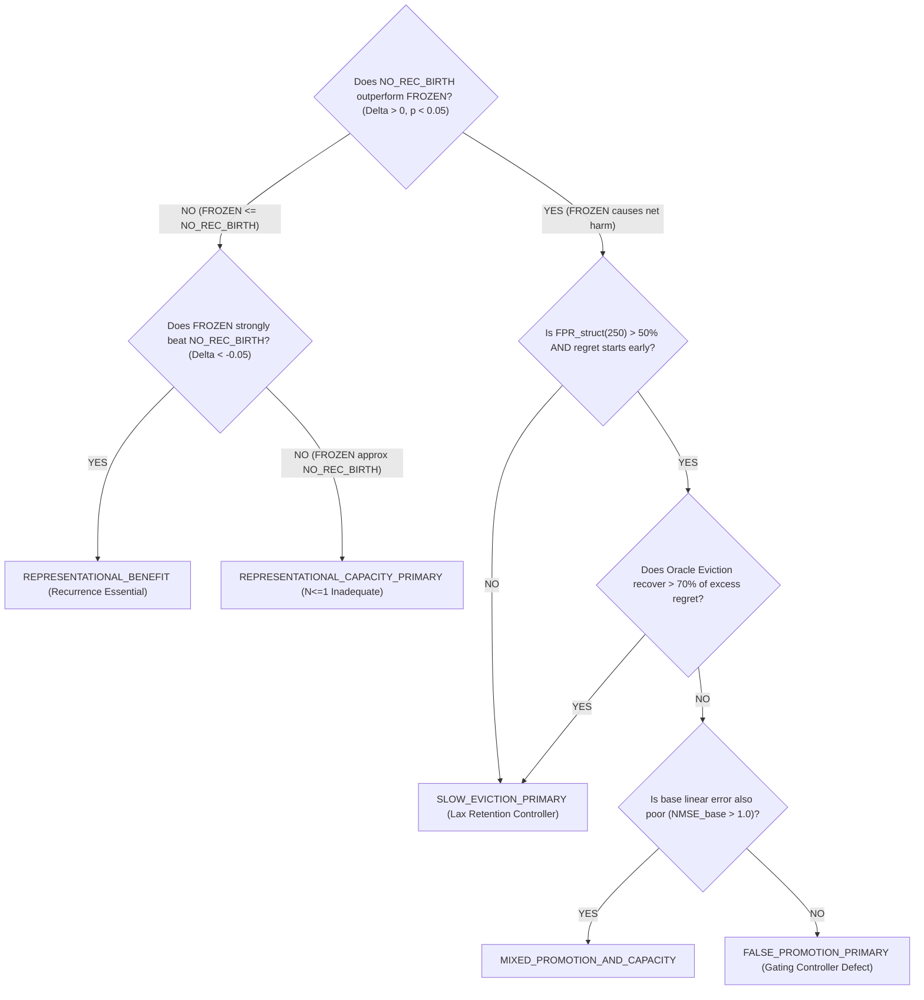

# LEBRE-DIAG-01: Promotion Harm & Representation Boundary Diagnostic Protocol

**Protocol ID:** `LEBRE-DIAG-01`  
**Status:** PREREGISTERED & LOCKED  
**Date:** 2026-09-19  
**Role:** Senior ML Researcher, Causal Experimentalist, Adaptive-Systems Auditor  
**Governing Architecture:** LEBRE v0.1 (`FROZEN_WITH_SCOPE_LIMITS`)  

---

## 1. Context & Research Problem

In sealed benchmark evaluations (`BENCH-01B`), LEBRE v0.1 achieved leading performance on non-stationary, event-driven, and physical streaming tasks (B1, B2, B3, B5, A5, A7, A8) with 0.00% numerical divergence across 450 runs under strict micro-edge constraints ($\le 100$ FLOPs/step mean, $\le 1024$ bytes persistent model RAM). However, on tasks characterized by discrete or dispersed temporal dependencies (**A2**: Single Delayed Dependency, **A3**: Multiple Dispersed Delays, **A4**: Long-Delay Scaling), LEBRE exhibited an aggregate NMSE of $\approx 1.13$, underperforming rich reservoir and gated baselines (Online ESN, Minimal GRU).

The goal of this diagnostic protocol is to rigorously determine **WHY** LEBRE v0.1 underperforms on A2–A4 by distinguishing between:
1. **Controller-induced harm** (false candidate promotion or sluggish eviction of deteriorated states).
2. **Fundamental representational capacity limits** of scalar recurrence ($N_{\text{rec}} \le 1$).

---

## 2. Competing Scientific Hypotheses

| Hypothesis | Designation | Causal Mechanism | Primary Empirical Signature |
| :--- | :--- | :--- | :--- |
| **H1** | `FALSE_PROMOTION` | Candidate units appear beneficial during short shadow probation ($T_{\text{prob}}$) by fitting local noise, pass promotion ($\theta_{\text{promote}}$), but fail to generalize out-of-sample, directly injecting error into active inference. | `LEBRE_NO_REC_BIRTH` outperforms `LEBRE_FROZEN`; $G_{\text{prob}} > 0.05$ followed by negative durable post-gain ($G_{\text{post}} < 0$); immediate post-promotion regret. |
| **H2** | `SLOW_EVICTION` | Candidates provide initial local benefit, but environment changes or parameters drift, making the state harmful. The dual-gate retention controller retains the harmful state too long due to maturity delays ($\tau_{\text{mature}}$) or patience counters ($N_{\text{pat}}$). | Initial post-gain is positive; sign flips later; state remains active for many steps ($T_{\text{evict\_response}} \gg 0$); immediate oracle eviction recovers large regret. |
| **H3** | `REPRESENTATIONAL_CAPACITY_LIMIT` | The lifecycle operates correctly, but a single scalar recurrent state ($N \le 1$) is mathematically unable to form the required discrete delay tap or multi-frequency memory regardless of parameter tuning. | `LEBRE_NO_REC_BIRTH` performs similarly poor to `LEBRE_FROZEN` (both NMSE $\approx 1.10+$); disabling recurrence does not solve the task; richer baselines with higher capacity (ESN, GRU) dominate. |
| **H4** | `NO_RECURRENT_VALUE` | The task has zero genuine recurrent structure or the linear baseline is fully optimal; any recurrent allocation is extraneous. | No recurrent candidates are needed; performance remains identical to linear; zero counterfactual gain across all horizons. |
| **H5** | `MIXED_FAILURE` | Both controller error (e.g., false promotion noise) and representational insufficiency contribute measurably to the observed regret. | Both incremental recurrent harm ($\Delta \text{NMSE} > 0$) and high base linear error ($\text{NMSE}_{\text{base}} > 1.0$) are observed simultaneously. |

---

## 3. Evaluated Tasks & Scope

### 3.1 Primary Diagnostic Tasks
- **`A2_Single_Delayed_Dependency`:** $y_t = 0.8 x_{1, t-4} + \epsilon_t$, $D=20$. Pure order-4 discrete lag.
- **`A3_Multiple_Dispersed_Delays`:** $y_t = 0.5 x_{1, t-2} + 0.5 x_{2, t-8} + \epsilon_t$, $D=20$. Multi-tap dispersed lag.
- **`A4_Long_Delay_Scaling`:** $y_t = 0.8 x_{1, t-30} + \epsilon_t$, $D=20$. Long temporal horizon (lag 30).

### 3.2 Positive Control Tasks (Known Recurrent Benefit)
- **`A5_Set_Reset_Quiescent_Memory`:** Bistable latch triggered by Poisson pulses. Requires persistent state retention.
- **`A7_Extended_Poisson_Quiescence`:** Analog cues separated by Poisson(150) silence gaps. Requires two-timescale memory.
- **`A8_Abrupt_Tri_Regime_Transition`:** Feedforward $\to$ Lag $\to$ Recurrent regime shifts. Tests dynamic structural elasticity.

*Constraint:* Task generation functions are imported directly from `experiments/bench01/streams.py` without alteration.

---

## 4. Evaluated Model Variants (Causal Ablation Suite)

1. **`LEBRE_FROZEN` (Canonical Baseline):**
   - Bit-exact frozen LEBRE v0.1 as wrapped in `TrackBFrozenWrapper`.
   - Frozen thresholds: $T_{\text{prob}} = 50$, $\theta_{\text{promote}} = 0.05$, $\tau_{\text{mature}} = 100$, $\theta_{\text{birth}} = 0.15$, $N_{\text{birth}} = 30$, $\alpha_{\text{slow}} = 0.005$, $\theta_{\text{ret}} = 0.02$, $\theta_{\text{obs}} = 0.80$, $N_{\text{pat}} = 30$, $N_{\text{rec}} \le 1$.
2. **`LEBRE_NO_REC_BIRTH` (Principal Causal Control):**
   - Identical in every respect to `LEBRE_FROZEN` (same normalization, sparse linear learner, learning rates, stream sequence), except `_trigger_birth` is inhibited.
   - Evaluates whether allowing recurrent births causally helps or harms the system.
3. **`LEBRE_SHADOW_ONLY` (Evidence Calibration Instrument):**
   - Candidates are born, updated via RTRL in shadow mode, and probation statistics are recorded, but candidates are **never** promoted to live prediction ($g_p = 0.0$ permanently; $y_{\text{hat}} = y_{\text{base}}$).
   - Isolates candidate probation quality from live inference contamination.
4. **`LEBRE_ORACLE_HARM_STOP` (Post-Hoc Eviction Upper Bound):**
   - Offline diagnostic tool. Operates identically to `LEBRE_FROZEN`, but continuously monitors cumulative counterfactual regret $R(t) = \sum_{\tau=t_{\text{prom}}}^t [(y_\tau - \hat{y}_\tau)^2 - (y_\tau - y_{\text{base}, \tau})^2]$. If cumulative regret remains positive for 20 consecutive steps, the oracle immediately evicts the active state.
   - Measures what fraction of regret is attributable to controller eviction latency.

---

## 5. Seed Protocol & Preregistered Plan

- **Evaluation Seeds:** $N = 30$ fresh seeds.
- **Preregistered Range:** Seeds `201` through `230` inclusive (`[201, 202, ..., 230]`).
- **Seed Pairing:** All 4 variants evaluate identical stream sequences for each seed.
- **Total Experimental Runs:** $6 \text{ tasks} \times 30 \text{ seeds} \times 4 \text{ variants} = 720 \text{ runs}$.

---

## 6. Formal Metric Definitions

1. **Normalized Mean Squared Error (NMSE):**
   $$\text{NMSE} = \frac{\text{MSE}}{\operatorname{var}(y_{\text{test}}) + 10^{-6}}, \quad \text{where } \text{MSE} = \frac{1}{N_{\text{test}}} \sum_{t=0.30T}^T (y_t - \hat{y}_t)^2$$
2. **Probation Gain Statistic ($G_{\text{prob}}$):**
   $$G_{\text{prob}} = 1 - \frac{\sum_{k=1}^{T_{\text{prob}}} (y_{t-k} - \hat{y}_{\text{prov}, t-k})^2}{\sum_{k=1}^{T_{\text{prob}}} (y_{t-k} - y_{\text{base}, t-k})^2}$$
3. **Post-Promotion Realized Gain ($G_{\text{post}}(H)$):**
   $$G_{\text{post}}(H) = 1 - \frac{\sum_{k=1}^H (y_{t_{\text{prom}}+k} - \hat{y}_{t_{\text{prom}}+k})^2}{\sum_{k=1}^H (y_{t_{\text{prom}}+k} - y_{\text{base}, t_{\text{prom}}+k})^2}$$
   Evaluated at horizons $H \in \{50, 100, 250, 500\}$.
4. **False Promotion Event (`FALSE_PROMOTION(H)`):**
   $$\text{FALSE\_PROMOTION}(H) \iff (G_{\text{prob}} > \theta_{\text{promote}}) \land (G_{\text{post}}(H) < 0)$$
   Primary benchmark horizon: $H = 250$.
5. **False Promotion Rate ($\text{FPR}_{\text{struct}}(H)$):**
   $$\text{FPR}_{\text{struct}}(H) = \frac{\sum \mathbf{1}\{\text{FALSE\_PROMOTION}(H)\}}{N_{\text{evaluable promotions at } H}}$$
6. **Harm Onset Step ($t_{\text{harm}}$):**
   First step $t > t_{\text{prom}}$ where moving counterfactual regret $\bar{r}_t = (1-\alpha) \bar{r}_{t-1} + \alpha (e_t^2 - e_{\text{base}, t}^2) > 0$ for 20 consecutive steps.
7. **Eviction Response Latency ($T_{\text{evict\_response}}$):**
   $$T_{\text{evict\_response}} = t_{\text{evict}} - t_{\text{harm}}$$
   If $t_{\text{evict}}$ does not occur before stream end, $T_{\text{evict\_response}}$ is marked as right-censored at $T - t_{\text{harm}}$.
8. **Harmful Retention Regret ($R_{\text{harm}}$):**
   $$R_{\text{harm}} = \sum_{t=t_{\text{harm}}}^{\min(t_{\text{evict}}, T)} [ (y_t - \hat{y}_t)^2 - (y_t - y_{\text{base}, t})^2 ]$$
9. **Oracle Eviction Recovery Fraction:**
   $$\text{RECOVERY\_FRACTION} = \frac{\text{Loss}(\text{LEBRE\_FROZEN}) - \text{Loss}(\text{LEBRE\_ORACLE})}{\text{Loss}(\text{LEBRE\_FROZEN}) - \text{Loss}(\text{LEBRE\_NO\_REC\_BIRTH})}$$

---

## 7. Diagnostic Decision Rules

The primary diagnostic classification for each task is resolved via the following preregistered decision tree:

---

## 8. Statistical Execution Plan

- **Bootstrap Uncertainty:** 10,000 paired bootstrap resamples for all mean differences and 95% confidence intervals.
- **Hypothesis Testing:** Paired Wilcoxon signed-rank tests across 30 seeds.
- **Multiple Comparison Control:** Holm-Bonferroni correction across primary comparisons.
- **Reporting:** Point estimates accompanied by 95% CIs and effect sizes (Cohen's $d_z$).
