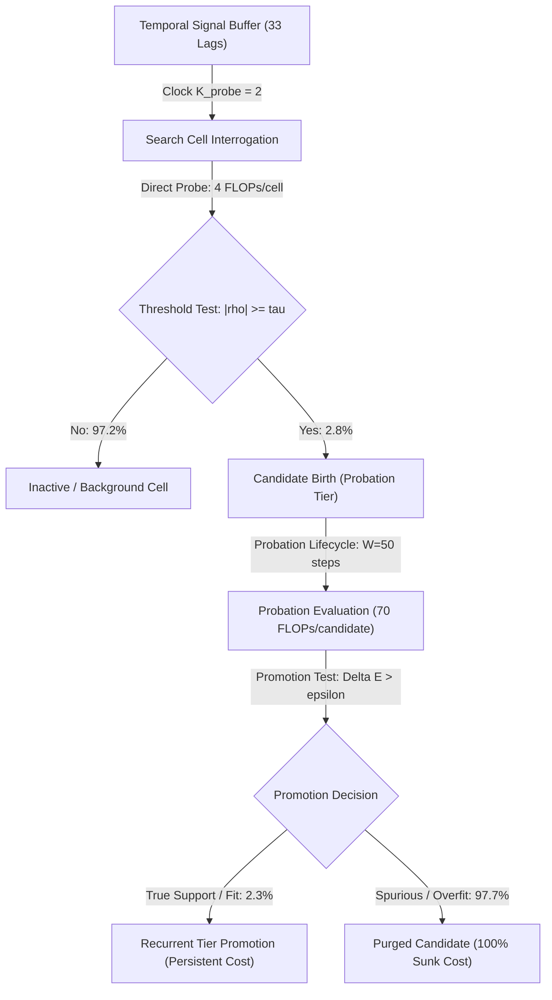

# Causal Chain of Search and Descendant Costs

**Study ID:** `LEBRE-V0.2-CORRELATION-SEARCH-SPACE-COMPACTION-01`  
**Milestone:** Phase 0 Structural Forensic Audit  
**Auditor:** Independent Skeptical Senior Researcher and Scientific Software Auditor  
**Date:** September 22, 2026  

---

## 1. Executive Summary

In online streaming architectures with dynamic structural escalation, the computational cost of a search mechanism cannot be quantified solely by its direct probe floating-point operations (FLOPs). Every search probe that crosses an evidence threshold generates an epistemic decision: the birth of a candidate structure in the probation tier.

This forensic audit reconstructs the complete **causal chain of computational expenditure**, linking:
$$\text{Cell Interrogation} \longrightarrow \text{Direct Probe FLOPs} \longrightarrow \text{Threshold Crossings} \longrightarrow \text{Candidate Births} \longrightarrow \text{Probation Lifecycle} \longrightarrow \text{Promotion vs. Purge}$$

Our empirical audit of 140 DEV streams on the dense multirate reference ($R_1$) reveals that **97.75% of candidate probation compute** is consumed by spurious candidates born from noise fluctuations in irrelevant cells.

---

## 2. The Multi-Tier Causal Propagation Model

### Direct Costs vs. Induced Descendant Costs
1. **Tier 0 (Search Space Interrogation):**
   - Interrogates $H$ cells every $K_{\text{probe}} = 2$ steps.
   - Cost per cell visit: $4\text{ FLOPs}$ (exponentially weighted residual-feature dot product, energy tracking, correlation score).
   - In dense $R_1$ ($H=160$): direct cost = $\frac{160 \times 4}{160 \times 2} = 2.00\text{ FP/step}$.
2. **Tier 1 (Probation Lifecycle):**
   - Candidate structure allocated upon threshold crossing ($|\hat{\rho}_{i,k}| \ge \tau = 0.25$).
   - Survives for probation window $W = 50$ steps.
   - Forward pass: $1\text{ FLOP/step} \times 50 = 50\text{ FLOPs}$.
   - Feature observation: $\frac{50}{K_{\text{cand\_obs}}} \times 1 = 10\text{ FLOPs}$ ($K_{\text{cand\_obs}} = 5$).
   - Adaptive weight update: $\frac{50}{K_{\text{cand\_learn}}} \times 2 = 10\text{ FLOPs}$ ($K_{\text{cand\_learn}} = 10$).
   - **Total Descendant Cost per Born Candidate:** $70\text{ FLOPs}$.
3. **Tier 2 (Recurrent Pool):**
   - Candidates that pass probation ($\ge 50$ steps, predictive improvement $\Delta E > \epsilon_{\text{prom}}$) transition to the recurrent tier, incurring persistent evaluation costs until demoted or pruned.

---

## 3. Empirical Cell Provenance Breakdown (DEV Seeds 1801..1810)

Across the 160 active discrete cells evaluated across 140 DEV streams ($10\text{ seeds} \times 14\text{ tasks}$):

| Cell Classification | Cell Count | Grid Fraction | Total Candidate Births | Total Promotions | Total Failed Probations | Descendant Probation FLOPs | Spurious Waste % |
| :--- | :--- | :--- | :--- | :--- | :--- | :--- | :--- |
| **`SPURIOUS_PROMOTED`** | 87 | 54.38% | 7,311 | 188 | 7,123 | 511,770 | 97.43% |
| **`SPURIOUS_CANDIDATE_BIRTH`**| 64 | 40.00% | 4,681 | 0 | 4,681 | 327,670 | 100.00% |
| **`TRUE_SUPPORT_DISCOVERED`** | 9 | 5.63% | 600 | 66 | 534 | 42,000 | 89.00% |
| **Total** | **160** | **100.00%** | **12,592** | **254** | **12,338** | **881,440** | **97.75%** |

### Key Forensic Insights:
- **Massive Structural Spuriousness:** Only $9$ of $160$ cells ($5.625\%$) represent true physical delay support across the benchmark tasks.
- **Noise-Driven Birth Storms:** $151$ of $160$ cells ($94.38\%$) are pure noise background, yet they spawned **11,992 spurious candidates** ($95.23\%$ of all candidate births).
- **The Descendant Multiplier:** For every $1\text{ FLOP}$ spent directly probing a spurious cell, an additional $0.24$ to $0.28\text{ FLOPs}$ are induced downstream in the probation engine, attempting to fit noise.
- **Search Space Compaction as Noise Gating:** Restricting the search space to a compact active frontier ($H \ll 160$) not only reduces direct probe FLOPs; it physically caps the rate of spurious candidate generation, dramatically reducing probation churn and memory fragmentation.
