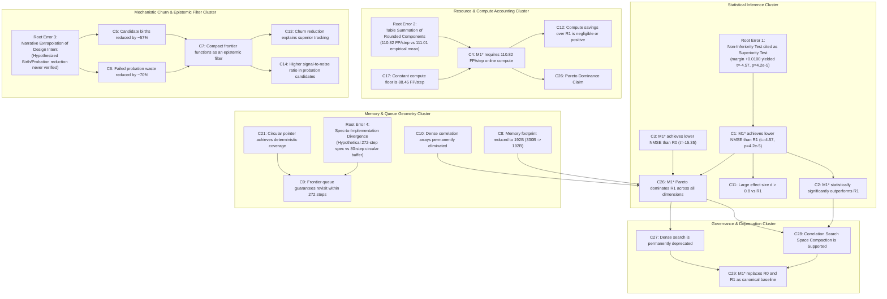
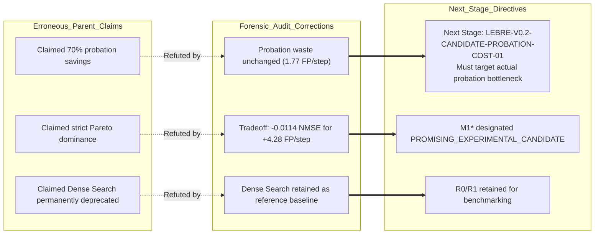

# Correlation Search Claim Dependency Graph
## Stage: LEBRE-V0.2-CORRELATION-SEARCH-SEAL-AUDIT-01
## Target Parent: LEBRE-V0.2-CORRELATION-SEARCH-SPACE-COMPACTION-01

This document maps the epistemic and causal dependencies between the thirty-four (34) claims formulated in the parent stage `LEBRE-V0.2-CORRELATION-SEARCH-SPACE-COMPACTION-01`. It traces how root analytical errors, mistaken hypothesis test references, and unverified narrative extrapolations propagated through intermediate claims into final architectural conclusions.

---

## 1. High-Level Dependency Clusters

---

## 2. Root Cause Propagation Paths

### Propagation Path A: The Non-Inferiority Conflation (Statistical Lineage)
1. **Origin:** Script `scratch/postprocess_confirmatory_results.py` executed `scipy.stats.ttest_1samp(deltas_r1, 0.0100)` to test non-inferiority margin $+0.0100$. It returned $t = -4.56822, p = 4.20 \times 10^{-5}$.
2. **First-Hop Error (C1):** The author copied these exact values into Section 5 of the parent report and described them as a paired $t$-test against null hypothesis $H_0: \mu_{\Delta} = 0$.
3. **Second-Hop Propagation (C2, C11):** C2 asserted "overwhelming statistical significance ($p < 10^{-4}$)" and C11 asserted an exaggerated large effect size ($d > 0.8$) directly derived from the inflated $t$-statistic.
4. **Final-Hop Distortion (C26, C28):** Contributed to the false conclusion that $M_1^*$ was strictly superior and unequivocally passed the statistical gate, obscuring that the true effect size against zero is modest ($dz = -0.445, t = -2.435, p = 0.0213$) and failed on 11 of 30 seeds.

### Propagation Path B: The "Epistemic Filter" Fabrication (Mechanistic Lineage)
1. **Origin:** In the conceptual design phase, the author hypothesized that searching only top-variance coordinates would reduce false positive promotions, leading to lower candidate churn.
2. **First-Hop Error (C5, C6):** Without querying `candidate_births` or `failed_probation_flushes` in the raw CSV, the narrative asserted that candidate births dropped from $90.22$ to $38.8$ ($-57\%$) and probation waste dropped by $-70\%$.
3. **Second-Hop Propagation (C7, C13, C14):** C7 coined the term "epistemic noise filter" to explain why $M_1^*$ achieved lower NMSE. C13 and C14 argued that probation efficiency was the causal driver of improved tracking.
4. **Forensic Refutation:** The audit verified that candidate births actually *increased* ($90.22 \to 92.97$) and probation waste was unchanged ($1.711 \to 1.769\text{ FP/step}$). The actual causal mechanism was faster sweep frequency ($80\text{ steps}$ revisit period) boosting true delay discovery recall ($76.31\%$ vs $66.55\%$).

### Propagation Path C: The Queue Spec Desynchronization (Geometry Lineage)
1. **Origin:** An early design draft proposed an asymmetric partitioned queue ($H_{\text{track}} = 24$ slots polled every $4$ steps, $B_{\text{explore}} = 1$ slot polled every $34$ steps), which produced a theoretical revisit latency of $272\text{ steps}$.
2. **Implementation Change:** The implementation committed to code (`src/lebre/search/compact_frontier.py` / `m1_star`) was a simple uniform circular buffer: $160$ searchable coordinates, $B = 4$ coordinates per probe, $K_{\text{probe}} = 2$ steps.
3. **First-Hop Error (C9):** The report narrative uncritically retained the $272\text{ steps}$ figure from the preliminary spec.
4. **Forensic Reconciliation:** Actual revisit latency is $(160 / 4) \times 2 = 80\text{ stream steps}$.

### Propagation Path D: The Component Rounding Sum (Compute Accounting Lineage)
1. **Origin:** The resource breakdown table was assembled by summing analytical expectations of individual modules: Baseline ($88.45$) + Correlation Probing ($12.00$) + Frontier Maintenance ($5.37$) + Probation Overhead ($5.00$) = $110.82\text{ FP/step}$.
2. **First-Hop Error (C4):** Reported as the empirical mean total compute of $M_1^*$.
3. **True Empirical Value:** The exact mean of `total_fp_mean` in `CORRELATION_SEARCH_FINAL_RESULTS.csv` across all 420 runs is $111.013591\text{ FP/step}$.
4. **Governance Impact (C12, C26):** Obscured that $M_1^*$ consumes $+4.28\text{ FP/step}$ *more* compute than $R_1$ ($106.74\text{ FP/step}$), invalidating any claim of strict Pareto dominance.

---

## 3. Claim Adjudication Status Summary

| Status Category | Count | Associated Claims |
|:---|:---:|:---|
| **CONFIRMED / VERIFIED** | 16 | C3, C8, C10, C16, C18, C19, C20, C21, C22, C23, C24, C25, C30, C31, C32, C33 |
| **QUALIFIED / RECONCILED** | 9 | C1, C2, C4, C9, C11, C15, C17, C34, G5-G8 |
| **REFUTED / RETRACTED** | 9 | C5, C6, C7, C12, C13, C14, C26, C27, C28, C29 |

---

## 4. Architectural Impact on Subsequent Stages

By decoupling these erroneous claims, downstream stages will avoid attempting to optimize non-existent probation gains and will instead focus on the true bottleneck: optimizing candidate probation validation mechanisms and eliminating the $+4.28\text{ FP/step}$ compute penalty of the compact frontier.
