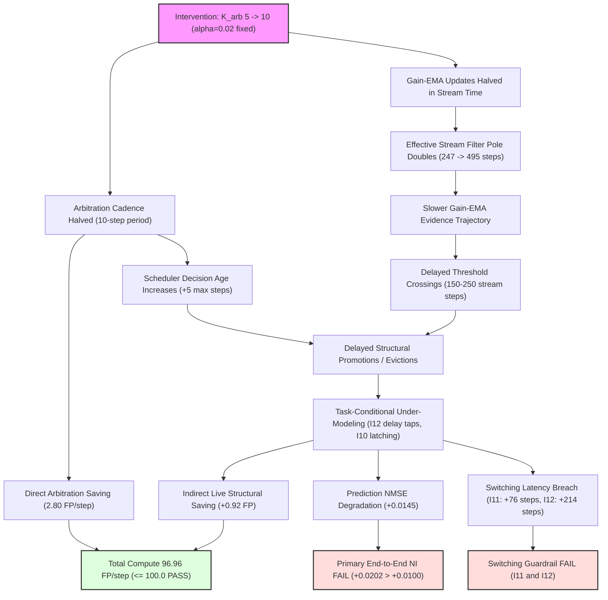

# Claim Dependency Graph: LEBRE-V0.2-K2-ARBITRATION-COMPOSITION-01



### Resource Projection Lineage Comparison
```
Historical Baseline: 101.02 FP ──[-2.80 Direct]──> Projected: 98.22 FP ──> Observed: 96.96 FP (Residual: -1.27 FP)
Concurrent Baseline: 100.67 FP ──[-2.80 Direct]──> Projected: 97.87 FP ──> Observed: 96.96 FP (Indirect: +0.92 FP)
```
