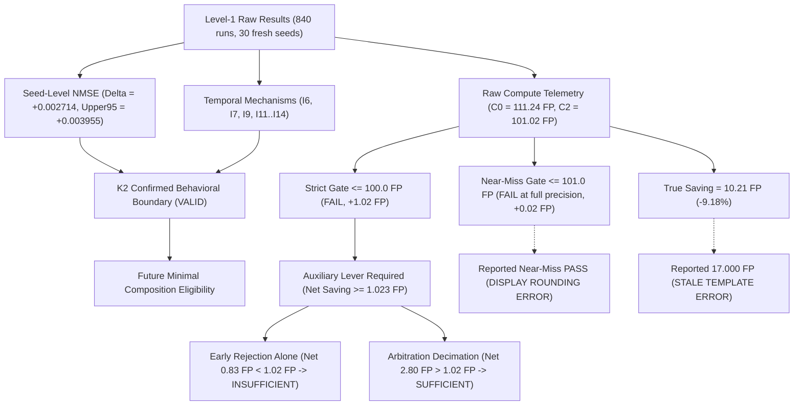

# Claim Dependency Graph & Scientific Robustness

### Explanatory Note on Evidentiary Independence
The dependency graph confirms that narrative reporting errors (the 17-FP template string, display rounding of the near-miss gate, and the correlation wording) are terminal leaf artifacts. They do not feed into the Level-1 raw data or the statistical lineage proving predictive non-inferiority and temporal mechanism preservation. Correcting these reporting defects leaves the core scientific behavioral boundary 100% intact.
