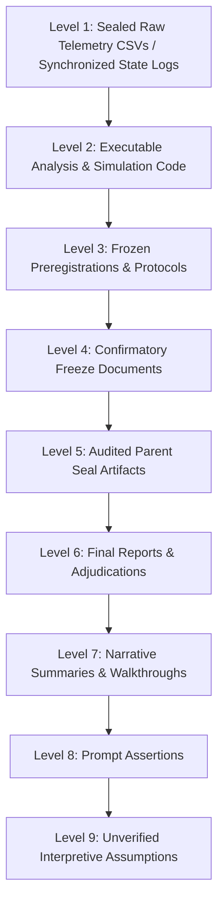

# Artifact Authority Map & Epistemic Hierarchy

**Stage ID:** `LEBRE-V0.2-K2-CORRECTIVE-CONFIRMATION-01`  
**Milestone:** Milestone 2 (Experimental Stream v0.2)  

### Invariant Rules:
1. **Physical Stream Primacy (Level 1):** Raw execution outputs (`K2_FINAL_RESULTS.csv`, state trajectories) are the sole empirical truth.
2. **Preregistration Binding (Level 3):** Evaluation criteria, non-inferiority margins ($\epsilon = +0.0100$), and resource ceilings ($\le 100.0\text{ FP}$) are immutable.
3. **Zero Post-Hoc Tuning:** No parameter, task subset, or threshold may be altered after inspecting outcome data.
