# Forensic Claim Dependency Graph

**Study:** `LEBRE-V0.2-MULTIRATE-SEAL-AUDIT-01`  
**Auditor:** Independent Skeptical Senior Scientific-Software Auditor  
**Date:** September 22, 2026  

---

## 1. Structural Dependency DAG

```mermaid
flowchart TD
    subgraph "Probation and Temporal Performance Subgraph"
        P1["Runtime Probation Semantics<br/>(obs_count >= 15)"] --> P2["Promotion Timing<br/>(Delayed by K_obs=5)"]
        P2 --> P3["Switching Latency<br/>(I11: +79.7, I12: +633.7)"]
        P2 --> P4["Pure-Lag NMSE<br/>(I4: +0.0339, I5: +0.0721)"]
        P3 --> P5["Aggregate Delta NMSE<br/>(+0.019376, 95% CI +0.027173)"]
        P4 --> P5
        P5 --> P6["Component Timescale Conflict<br/>(Primary Outcome)"]
        
        R1["Reporting Error in Text<br/>('T_prob = 300')"] -.->|"Narrative Only<br/>(Not Executed)"| P1
    end

    subgraph "Memory Governance Subgraph"
        M1["Raw Model Memory State<br/>(Base 904 B, Lag +64 B, Rec +96 B)"] --> M2["Mean Persistent RAM<br/>(970.34 B)"]
        M1 --> M3["Max Occupied Persistent<br/>(1064 B)"]
        M1 --> M4["Peak Working SRAM<br/>(1064 B FPU / 1072 B Stack)"]
        
        M2 --> M5["Historical R2-MEM Gate<br/>(<= 1024 B Mean)"]
        M5 --> M5A["HISTORICAL_R2_STATUS = PASS"]
        
        M4 --> M6["Shadow-Rent Gate 3<br/>(<= 1024 B Peak SRAM)"]
        M6 --> M6A["PEAK_WORKING_1K_STATUS = FAIL"]
        
        M3 -.->|"Conflated in Report Text"| M5
    end
```

---

## 2. Dependency Impact Analysis

1. **Probation Subgraph Integrity:**
   - Because the runtime executed $T_{\text{prob}} = 15$ shadow observations, the trajectory of $M_1$ was determined strictly by the multirate clocks ($K_{\text{probe}}=2, K_{\text{obs}}=5, K_{\text{learn}}=10, K_{\text{rec}}=1, K_{\text{arb}}=5$).
   - The reporting error ($300$) was isolated to narrative documentation. It did not infect the runtime execution graph.
   - Therefore, the downstream causal links ($P1 \to P2 \to P3, P4 \to P5 \to P6$) are causally unconfounded.
2. **Memory Subgraph Disaggregation:**
   - The raw memory state ($M1$) branches into two distinct operational definitions:
     - Mean persistent RAM ($M2$), which satisfies the historical R2 ceiling ($970.34 \le 1024\text{ B}$).
     - Peak working SRAM ($M4$), which violates the newer 1-KiB working envelope ($1064 > 1024\text{ B}$).
   - Correcting the conflation preserves historical R2 compliance while upholding Gate 3 peak SRAM rejection.
