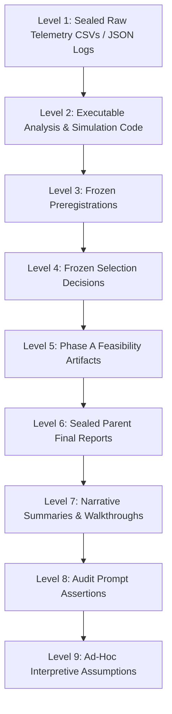

# Artifact Authority Map & Epistemic Hierarchy

**Stage ID:** `LEBRE-V0.2-RECURRENT-SHADOW-SEAL-AUDIT-01`  
**Milestone:** Forensic Seal Audit Authority Specification  

### Hierarchy Rules:
1. **Level 1 Overrides All:** Level-1 raw CSV telemetry (`RECURRENT_FINAL_RESULTS.csv`, `RECURRENT_DEV_RESULTS.csv`) represents physical stream truth. Narrative summaries, prompt text, or derived tables cannot alter raw execution values.
2. **Level 3 Binds Governance:** The pre-DEV frozen preregistration defines valid hypotheses and success criteria. Selection decisions at Level 4 that breach Level 3 criteria are invalid as confirmatory steps regardless of narrative text.
3. **No Retroactive Reinterpretation:** Higher levels cannot be modified retroactively to conform with lower-level narrative statements.
