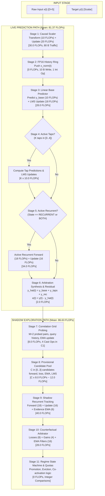

# Compute Execution Graph & Per-Step Execution Flow

**LEBRE-V0.2-RESOURCE-COMPACTION-SEAL-01**

---

## 1. Per-Step Architectural Execution Graph

---

## 2. Quantitative Step-Budget Decomposition

The per-step computational budget decomposes into four distinct architectural regimes:

| Stage | Operation Description | Execution Scope | FP FLOPs | Integer Ops | Bytes Moved |
| :--- | :--- | :--- | :---: | :---: | :---: |
| **Stage 1** | Causal Standard Scaler | Live (Permanent) | $30.0$ | $0$ | $80$ |
| **Stage 2** | History Ring Buffer Push | Shared (Permanent) | $0.0$ | $2$ | $10$ |
| **Stage 3** | Linear Base Predictor | Live (Permanent) | $28.0$ | $0$ | $80$ |
| **Stage 4** | Active Delay Tap LMS | Conditional Live | $0$ to $40.0$ | $0$ to $8$ | $0$ to $64$ |
| **Stage 5** | Active Recurrent Unit | Conditional Live | $0$ or $34.0$ | $0$ | $0$ to $48$ |
| **Stage 6** | Synthesis & Error Formation | Live (Permanent) | $2.0$ | $0$ | $8$ |
| **Stage 7** | Correlation Grid Probing | Shadow Exploration | $8.0$ | $4$ (C1) | $16$ |
| **Stage 8** | Candidate Pool Maintenance | Shadow Exploration | $0$ to $24.0$ | $0$ to $6$ | $0$ to $48$ |
| **Stage 9** | Shadow Recurrent Unit | Shadow Exploration | $40.0$ | $0$ | $48$ |
| **Stage 10** | Counterfactual Loss Arbitrator| Shadow Exploration | $28.0$ | $0$ | $64$ |
| **Stage 11** | Topology Mutation Logic | Shadow Logic | $0.0$ | $12$ | $16$ |

---

## 3. Structural Regime Analysis

Depending on the operational state determined by Stage 11, the total per-step resource consumption fluctuates:

### Regime 1: Memoryless Quiescent State (`NONE`)
- **Active Structural Modules:** Base predictor only ($K=0, \text{Active Rec}=0$).
- **Live Compute:** $30.0 (\text{scaler}) + 28.0 (\text{base}) + 2.0 (\text{synth}) = \mathbf{60.0 \text{ FP FLOPs/step}}$.
- **Shadow Compute:** Full exploration runs: $8.0 + 40.0 + 28.0 = \mathbf{76.0 \text{ FP FLOPs/step}}$.
- **Total Online Compute:** $60.0 + 76.0 = \mathbf{136.0 \text{ FP FLOPs/step}}$.

### Regime 2: Pure Discrete Delay State (`LAG`)
- **Active Structural Modules:** Base predictor + $K=1$ active tap ($I_3$).
- **Live Compute:** $60.0 + 10.0 = \mathbf{70.0 \text{ FP FLOPs/step}}$.
- **Shadow Compute:** $8.0 + 8.0 (\text{cand}) + 40.0 + 28.0 = \mathbf{84.0 \text{ FP FLOPs/step}}$.
- **Total Online Compute:** $70.0 + 84.0 = \mathbf{154.0 \text{ FP FLOPs/step}}$.

### Regime 3: Pure Continuous Latent State (`RECURRENT`)
- **Active Structural Modules:** Base predictor + active recurrent unit ($I_6$).
- **Live Compute:** $60.0 + 34.0 = \mathbf{94.0 \text{ FP FLOPs/step}}$.
- **Shadow Compute:** $8.0 + 16.0 (\text{cand}) + 40.0 + 28.0 = \mathbf{92.0 \text{ FP FLOPs/step}}$.
- **Total Online Compute:** $94.0 + 92.0 = \mathbf{186.0 \text{ FP FLOPs/step}}$.

### Regime 4: Full Hybrid State (`BOTH`)
- **Active Structural Modules:** Base predictor + $K=2$ taps + active recurrent ($I_9$).
- **Live Compute:** $60.0 + 20.0 + 34.0 = \mathbf{114.0 \text{ FP FLOPs/step}}$ (peaks at $127.2$).
- **Shadow Compute:** $8.0 + 24.0 (\text{cands}) + 40.0 + 28.0 = \mathbf{100.0 \text{ FP FLOPs/step}}$.
- **Total Online Compute:** $114.0 + 100.0 = \mathbf{214.0 \text{ FP FLOPs/step}}$ (peaks at $221.0$).

---

## 4. Key Architectural Insights for Stage 2.3

1. **Live Compute is Inherently Compliant on Single Regimes:** Under memoryless, single delay, and multi-delay regimes ($I_1$–$I_5$), live compute averages $58.0$–$88.9$ FLOPs, comfortably below the 100 FLOP legacy ceiling.
2. **Shadow Compute is the Dominant Online Tax:** Shadow computation consumes $76.0$ to $100.0$ FLOPs continuously at *every single time step*, even when the system is in a stable, stationary regime.
3. **Duty-Cycling Potential:** In stationary regimes, correlation probing ($8$ FLOPs) and shadow recurrent evaluation ($40$ FLOPs) can be duty-cycled to $10\%$–$20\%$ frequency, reducing average shadow compute from $86.6$ FLOPs to $< 15.0$ FLOPs. This establishes the exact technical charter for `LEBRE-V0.2-SHADOW-RENT-GOVERNANCE-01`.
