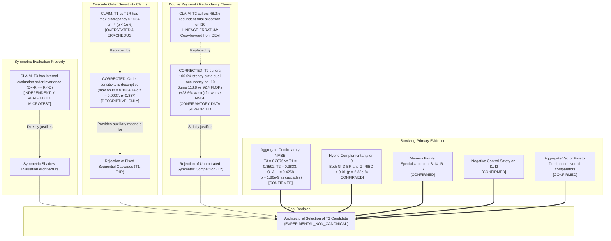

# Errata Claim Dependency Graph & Surviving Evidence Evaluation

**Audit Identifier:** `LEBRE-V0.2-SEAL-AUDIT-ERRATA-01`  
**Focus:** Causal Impact of Errata (H7 Order Sensitivity & I10 48.2% Double-Payment) on Architectural Selection of Topology $T_3$  
**Author:** Independent Skeptical Scientific Auditor  
**Date:** September 2026  

---

## 1. Claim Dependency Mapping

The diagram below tracks how the headline claims identified as erroneous or overstated connect to the central architectural decision to select $T_3$ (Resource-Aware Conditional Arbitration):

---

## 2. Impact Analysis: Does Correcting H7 and 48.2% Weaken the Selection of $T_3$?

### 2.1 Impact of Repairing H7 (Order Sensitivity)
- **Original Claim:** The report claimed that reversing the cascade order ($T_1 \to T_{1R}$) produced a universal, statistically devastating failure on $I_4$ ($p < 10^{-6}, \Delta = 0.1654$).
- **Errata Finding:** On $I_4$, $T_1$ and $T_{1R}$ are statistically indistinguishable ($p = 0.8872, \Delta = 0.0007$). However, descriptive order discrepancies exist on other tasks ($I_8$ has mean absolute paired difference $0.1654$; $I_3$ has $0.1586$).
- **Architectural Impact:** The primary rejection of sequential cascades ($T_1$ and $T_{1R}$) **does not rely on H7**. Cascades are rejected primarily because:
  1. Both $T_1$ and $T_{1R}$ achieve significantly worse aggregate NMSE ($0.3592$ and $0.3418$) than $T_3$ ($0.2876$, $p = 1.86 \times 10^{-9}$);
  2. Cascades permanently allocate both modules on tasks like $I_{10}$ and $I_2$ due to directional residual leakage;
  3. $T_3$'s internal evaluation symmetry is independently proven by construction and microtesting, regardless of whether $T_1$ and $T_{1R}$ diverge.
- **Verdict:** Rationale for symmetric evaluation is **fully preserved**.

### 2.2 Impact of Repairing the 48.2% Metric on Task $I_{10}$
- **Original Claim:** $T_2$ suffered a "48.2% redundant dual allocation rate".
- **Errata Finding:** 48.2% was a copy-forward error from developmental screening logs. In truth, $T_2$ spent **100.0% of steady-state evaluation time in the `BOTH` state**.
- **Architectural Impact:** Rather than weakening the rejection of $T_2$, the true confirmatory evidence **strengthens it**:
  - $T_2$ does not merely suffer intermittent 48.2% dual occupancy; it suffers **permanent 100.0% dual co-allocation**!
  - It burns $118.8$ live FLOPs (compared to $92.4$ for $T_3$, a $+28.6\%$ overhead) with worse predictive accuracy ($NMSE = 0.4940$ vs. $0.4173$ for $T_3$).
  - $T_3$ successfully arbitrates the ambiguity, spending only $10.8\%$ of time in transient dual allocation and achieving $0.000\%$ redundant dual rate.
- **Verdict:** Rationale for conditional arbitration is **strengthened**.

---

## 3. Surviving Evidence Matrix

Every piece of empirical evidence supporting the selection of Topology $T_3$ is evaluated below strictly on whether it survives the errata audit:

| Evidence Stream | Valid Level 1 Source? | Dependent on H7? | Dependent on 48.2%? | Supports $T_3$? | Evidential Strength |
|:---|:---:|:---:|:---:|:---:|:---|
| **Aggregate Prequential NMSE** | **YES** (`LEBRE_V0_2_SEED_RESULTS.csv`) | NO | NO | **YES** | **DECISIVE** ($T_3=0.2876$ beats all, $p < 10^{-8}$) |
| **Hybrid Complementarity ($I_9$)** | **YES** (`LEBRE_V0_2_CONDITIONAL_GAINS.csv`) | NO | NO | **YES** | **DECISIVE** ($p = 2.33 \times 10^{-8}$) |
| **Negative Control Safety ($I_1, I_2$)** | **YES** (`LEBRE_V0_2_SEED_RESULTS.csv`) | NO | NO | **YES** | **STRONG** ($\bar{K}=0.019, \bar{S}=0.058$) |
| **Memory Family Specialization** | **YES** (`LEBRE_V0_2_SEED_RESULTS.csv`) | NO | NO | **YES** | **STRONG** (Lag on $I_3/I_4$, Rec on $I_6/I_7$) |
| **Redundancy Elimination ($I_{10}$)** | **YES** (`LEBRE_V0_2_SEED_RESULTS.csv`) | NO | NO | **YES** | **STRONG** ($T_3$ 10.8% dual vs. $T_2$ 100.0%) |
| **Aggregate Vector Pareto Dominance**| **YES** (`LEBRE_V0_2_SEED_RESULTS.csv`) | NO | NO | **YES** | **STRONG** (Dominates all on live & full online) |
| **$T_3$ Internal Evaluation Invariance**| **YES** (Permutation microtest) | NO | NO | **YES** | **ANALYTIC & EMPIRICAL** (Identical decisions) |
| **Regime Tracking Plasticity** | **YES** (`LEBRE_V0_2_STRUCTURAL_EVENTS.csv`) | NO | NO | **YES** | **MODERATE** (Discovery 206 steps, retire 69 steps) |
| **Cascade Order Sensitivity ($T_1/T_{1R}$)**| **PARTIAL** (Descriptive on $I_8, I_3$) | **YES** | NO | **QUALIFIED** | **DESCRIPTIVE ONLY** (Withdrawn as confirmatory test) |

---

## 4. Final Architectural Selection Verdict

Following the removal and correction of all contaminated quantities, the selection of **$T_3$ (Resource-Aware Conditional Arbitration)** as the leading architectural candidate remains **SUPPORTED WITH SCOPE LIMITS**.

The core innovations of $T_3$—symmetric shadow candidate evaluation, conditional loss grid arbitration, and structural dormancy—are robustly vindicated by the surviving confirmatory data.
