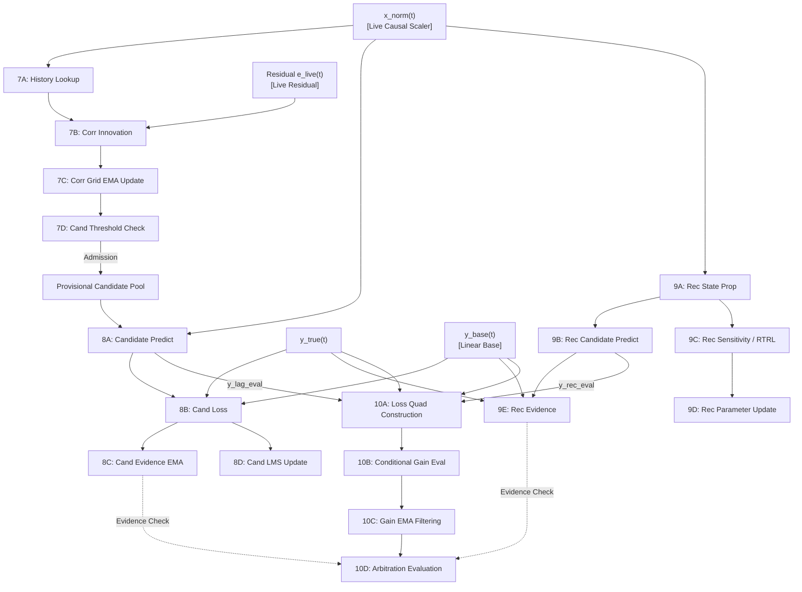

# Shadow Atomic Dependency DAG & Staleness Dynamics

**Study ID:** `LEBRE-V0.2-SHADOW-MULTIRATE-DECOMPOSITION-01`  
**Milestone:** Milestone 2 (Experimental Stream v0.2)  
**Author:** Independent Skeptical Senior Researcher  
**Date:** September 22, 2026  

---

## 1. Executive Summary

Monolithic whole-shadow downsampling failed in study $S_2$ and $S_3$ because downstream arbitration components consumed stale, decimated signals as if they were synchronous and fresh. This document establishes the formal Directed Acyclic Graph (DAG) of the 17 atomic shadow operations and specifies the precise staleness failure mode for every computational dependency.

---

## 2. Mermaid Atomic Dependency DAG



---

## 3. Dependency Staleness Matrix & Failure Analysis

```
+---------------+-----------------------+------------------------------------+-------------------------------------------+
| Operation     | Upstream Dependency   | What Becomes Stale If Skipped?      | Concrete Downstream Failure Mode          |
+---------------+-----------------------+------------------------------------+-------------------------------------------+
| 7B / 7C       | History Lookup & Res  | Correlation cell (i, k)             | Delay discovery delayed by K steps;       |
|               |                       | remains at previous estimate       | true lags stay dormant longer.            |
+---------------+-----------------------+------------------------------------+-------------------------------------------+
| 8A            | Delayed feature query | Candidate prediction y_lag_eval    | Arbitrator compares fresh live error with |
|               |                       | is held at previous step           | stale lag prediction; gains distorted.    |
+---------------+-----------------------+------------------------------------+-------------------------------------------+
| 8C / 8D       | Candidate loss e_cand | Candidate weight w and evidence    | Candidate weight remains unadapted;       |
|               |                       | frozen; probation age frozen       | mature candidates not promoted on time.   |
+---------------+-----------------------+------------------------------------+-------------------------------------------+
| 9A            | Hidden state h(t-1)   | Recurrent hidden state h(t)        | PATH-DEPENDENCE COLLAPSE: Skipping state  |
|               | and input x_norm(t)   | loses continuous dynamical trace   | propagation destroys temporal continuity! |
+---------------+-----------------------+------------------------------------+-------------------------------------------+
| 9C / 9D       | RTRL gradients        | Recurrent weights (w_h, w_x)       | Recurrent parameter convergence slows,    |
|               | and error             | stay at current values             | but state trajectory remains valid.       |
+---------------+-----------------------+------------------------------------+-------------------------------------------+
| 9E            | Shadow prediction     | Recurrent evidence EMA             | Recurrent promotion delayed; does not     |
|               | error e_rec           | remains held                       | track sudden continuous latent shifts.    |
+---------------+-----------------------+------------------------------------+-------------------------------------------+
| 10A / 10B     | Live y_base, y_lag,   | Counterfactual loss quadruplet     | Gain EMA updates with asynchronous errors;|
|               | y_rec, and y_true     | has mismatched component ages      | false co-occupancy or spurious eviction.  |
+---------------+-----------------------+------------------------------------+-------------------------------------------+
| 10C / 10D     | Raw conditional gains | Filtered gains and allocation      | Structural switches execute with lag      |
|               |                       | decisions                          | equal to downsampling period K.           |
+---------------+-----------------------+------------------------------------+-------------------------------------------+
```

---

## 4. Architectural Rules Derived from the DAG

1. **Rule of Path Continuity:**  
   Because operation `9A` (Recurrent State Propagation) updates the non-linear autoregressive state $h(t) = \tanh(w_h h(t-1) + w_x x(t))$, skipping `9A` causes irrecoverable loss of dynamical memory. Therefore:
   $$\mathbf{K_{\text{rec\_prop}} = 1 \quad (\text{Mandatory Continuous State Propagation})}$$
2. **Rule of Evidence Synchrony:**  
   Counterfactual loss construction (`10A`) requires comparing $P_{\text{BASE}}$, $P_{\text{BASE\_D}}$, $P_{\text{BASE\_R}}$, and $P_{\text{BASE\_D\_R}}$ against $y(t)$. If $y_{\text{lag}}$ or $y_{\text{rec}}$ is older than a specified freshness bound ($\tau_{\text{max}} = 2$ steps), `10A` and `10C` **must be skipped entirely**. Stale gains must never be passed to the EMA filter.
