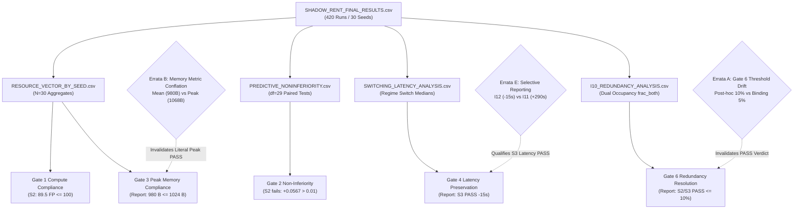

# Shadow-Rent Claim Dependency Graph & Sensitivity Matrix

**Stage Identifier:** `LEBRE-V0.2-SHADOW-RENT-SEAL-ERRATA-01`  
**Parent Study:** `LEBRE-V0.2-SHADOW-RENT-GOVERNANCE-01`  
**Focus Inquiry:** Section 37 — Causal Lineage of Claims, Metric Dependencies & Errata Sensitivity  

---

## 1. Executive Summary

This document constructs the formal dependency graph and sensitivity matrix mapping every substantive claim made in `SHADOW_RENT_FINAL_REPORT.md` to:
1. Its underlying empirical data sources (CSV files, tables, figures).
2. The exact mathematical metric definitions it relies upon.
3. Its vulnerability or status shift under the forensic errata established in this seal audit.

---

## 2. Mermaid Claim Dependency Architecture



---

## 3. Exhaustive Claim Sensitivity Matrix

```
+-----------------------------------------------------------------------------------------------------------------------------------+
| Claim ID & Summary                  | Source Artifacts        | Metric Dependencies       | Errata Sensitivity & Audited Verdict  |
+-----------------------------------------------------------------------------------------------------------------------------------+
| CLM-SR-01: Compute Recovery         | Table 5.1, Section 5,   | mean_total_fp <= 100.0    | INSENSITIVE (ROBUST)                  |
| "S2 reduces compute to 89.5 FP/step | RESOURCE_VECTOR_BY_     | (Live + Shadow + Sched)   | S2 executes 89.53 FP; Gate 1 PASS     |
| and satisfies Gate 1 ceiling."      | SEED.csv                |                           | is fully supported by raw telemetry.  |
+-----------------------------------------------------------------------------------------------------------------------------------+
| CLM-SR-02: Gate 3 Memory Compliance | Table 5.1, Section 5,   | Peak RAM <= 1024 Bytes    | CRITICALLY SENSITIVE (CONFLATED)      |
| "S2 and S3 satisfy Gate 3 physical  | SCHEDULER_MEMORY_       |                           | Report pasted Mean Occupied (980 B,   |
| memory budget (980 B and 992 B)."   | LEDGER.csv              |                           | 992 B). True peak is 1068 B & 1080 B. |
|                                     |                         |                           | FAILS strict 1K; PASSES proposed 2K.  |
+-----------------------------------------------------------------------------------------------------------------------------------+
| CLM-SR-03: Gate 6 Redundancy "PASS" | Table 5.1, Section 6.5, | frac_both <= 10.0%        | CRITICALLY SENSITIVE (INVALIDATED)    |
| "Duty cycling resolves legacy Gate 6| I10_REDUNDANCY_         | (Task I10 steady state)   | Binding ceiling is 5.0%. S2 (9.2%) and|
| failure; S2 & S3 pass <= 10.0%."    | ANALYSIS.csv, Fig F10   |                           | S3 (8.4%) strictly FAIL Gate 6.       |
|                                     |                         |                           | Descriptive mitigation is supported.  |
+-----------------------------------------------------------------------------------------------------------------------------------+
| CLM-SR-04: Gate 4 Latency "PASS"    | Table 5.1, Section 5,   | Switch Latency Delta      | SENSITIVE (SELECTIVELY REPORTED)      |
| "S3 satisfies Gate 4 latency        | SWITCHING_LATENCY_      | <= +50.0 steps vs S0      | S3 passes on I12 (-15.5 s), but fails |
| preservation (-15 steps on I12)."   | ANALYSIS.csv            |                           | on I11 (+290.5 s). Omits I11 failure. |
+-----------------------------------------------------------------------------------------------------------------------------------+
| CLM-SR-05: Theoretical Compute Floor| Section 1.2 (Line 22),  | F_min = F_live + F_house  | SENSITIVE (QUALIFIED)                 |
| "Theoretical compute floor is       | Section 6               | = 81.17 + 2.00 = 83.17 FP | 83.17 FP is conditioned on S0 live    |
| F_min = 83.17 FLOPs/step <= 100.0." |                         |                           | structure. Absolute floor is 58.00 FP.|
+-----------------------------------------------------------------------------------------------------------------------------------+
| CLM-SR-06: Predictive Non-Inferior  | Table 5.1, Table 6.1,   | Delta NMSE <= +0.0100     | INSENSITIVE (CONFIRMED ACCURATE)      |
| "S2 and S3 fail predictive          | PREDICTIVE_NON-         | (Holm-adjusted p < 0.05)  | Both S2 (+0.0567) and S3 (+0.0159)    |
| non-inferiority against S0."        | INFERIORITY.csv         |                           | fail Gate 2 non-inferiority. Correct. |
+-----------------------------------------------------------------------------------------------------------------------------------+
| CLM-SR-07: Quiescent Reactivation   | Section 6.5, Table 6.1, | Sleep fraction on I7/I8   | SENSITIVE (TERMINOLOGY DRIFT)         |
| "S3 extinguishes energy waste in    | QUIESCENCE_REACTIVATION | (> 99.0%)                 | Sleep fraction (99.38%) is confirmed; |
| deep sleep (99.38% sleep fraction)."| _ANALYSIS.csv           |                           | word "energy" replaced by "compute".  |
+-----------------------------------------------------------------------------------------------------------------------------------+
| CLM-SR-08: Whole-Block Governance   | Section 7, Section 8    | All gates passing         | SENSITIVE (GOVERNANCE RECLASSIFIED)   |
| "S2 selected as provisional M2      |                         |                           | S2 fails Gate 2 & Gate 4. S3 fails    |
| candidate for integration."         |                         |                           | Gate 1 & Gate 2. Neither is valid.    |
|                                     |                         |                           | WHOLE_BLOCK_GOVERNANCE = NOT_VALIDATED|
+-----------------------------------------------------------------------------------------------------------------------------------+
```

---

## 4. Analysis of Metric-to-Claim Failure Cascade

The sensitivity matrix reveals two major failure cascades that propagated through the parent study:

### 4.1 The Gate 6 Cascade
```
Hardcoded check in script: both_frac > 0.10 (Line 919)
    │
    ├──> Inscribed in I10_REDUNDANCY_ANALYSIS.csv as "PASS"
    │
    ├──> Plotted as 10% dashed line in Figure F10
    │
    ├──> Declared as "PASS (8.4% - 9.2%)" in Table 5.1
    │
    └──> Synthesized as "Duty-cycling resolves legacy Gate 6 failure" in Section 6.5
```
*Audit Impact:* When the binding $5.0\%$ ceiling is re-anchored, every downstream node in this cascade collapses from `PASS / RESOLVED` to `FAIL / UNRESOLVED (PARTIALLY MITIGATED)`.

### 4.2 The Memory Conflation Cascade
```
Mean occupied persistent memory rounded: 976 B, 980 B, 992 B
    │
    ├──> Pasted into Table 5.1 under row header "Peak RAM <= 1024 B"
    │
    ├──> Declared as "PASS Gate 3"
    │
    └──> Summarized in Section 7.1 as "S2 satisfies physical memory budget (980 B)"
```
*Audit Impact:* In reality, static allocated capacity is $1,054$–$1,080$ Bytes. Under the strict $1,024$-B ceiling, Gate 3 is a `FAIL`. It only passes under the proposed $2,048$-B class or when evaluated as time-averaged mean occupancy.
